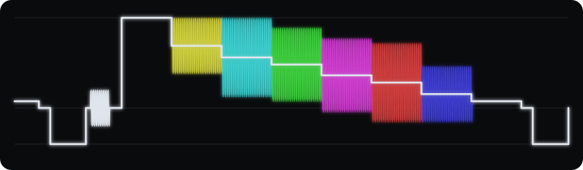

# ntscenery



> A real-time NTSC / VHS / composite-video glitch simulator, running entirely in
> WebGPU compute shaders

**[Live demo](https://cmdcolin.github.io/ntscenery/)** ·
**[Documentation](https://cmdcolin.github.io/ntscenery/guide/)**

The demo needs a WebGPU-enabled browser.

Each frame gets encoded into a real composite video waveform, mangled like it
went through tape and RF, then decoded by an imperfect TV. Dot crawl, ringing,
hue drift, tearing, head-switch bend and dropouts all fall out of the signal on
their own, the same as they do on real gear.

## Screenshot

[](https://cmdcolinphotos.s3.amazonaws.com/phosphene/demo-v2.mp4)

<sub>▶ **In motion:**
[watch the 7-second clip](https://cmdcolinphotos.s3.amazonaws.com/phosphene/demo-v2.mp4)
(or click the image above) · or open the
[live demo](https://cmdcolin.github.io/ntscenery/) and load your own
footage.</sub>

## Features

- 130+ settings across wiring, camera feedback, the mixer loop, tape and RF, the
  receiver and the screen itself, [docs/EFFECTS.md](docs/EFFECTS.md).
- Can provide a variety of input from user provided image, video, or NTSC color
  bars, and you can mix multiple video sources including 'dirty' video mixing
- Two feedback loops: a camera aimed at its own monitor, and a mixer patched
  back into itself down at the signal level.
- Presets to start from, slots to save your own, a randomize button, and ctrl+z.
- Any slider can be driven by an LFO, a random walk, a sample-and-hold, a Lorenz
  attractor, or the level of whatever audio is playing.
- Plug in a mic or a track and let it shove the picture around: bass into the
  field oscillator, level into line hold, the raw waveform into the deflection
  coils.
- MIDI controllers work. It learns one control at a time or automaps a whole
  device, won't jump when a knob is out of position, and locks rate controls to
  incoming clock. Never set one up? [MIDI.md](docs/MIDI.md) starts from plugging
  it in.
- Record to webm, save a png, or pop the controls into a second window and give
  the picture the whole screen. For anything you care about, point OBS at the
  window instead. It beats the in-browser recorder on quality and can follow the
  magnifier at full display resolution.
- The whole state fits in a URL, so you can send someone a link to a look.
- Works on a phone. Held upright the picture takes the top of the screen and the
  controls scroll under it; turned sideways it goes back to a sidebar. Drag the
  picture to move the magnifier, and every knob is sized for a fingertip.
- Scopes for watching the waveform, plus render scale, FPS, a map of the chain,
  and per-pass GPU timings.

## Run

```
pnpm install
pnpm dev
```

Running locally adds a **YouTube…** source the hosted demo can't have. Paste a
URL and the dev server shells out to `yt-dlp`, caches the clip and feeds it in,
so you can dub anything on the internet to tape. It needs `yt-dlp` on your PATH;
the deployed build has no server to shell out from, so the option does nothing
there. Details in
[docs/DEVELOPMENT.md](docs/DEVELOPMENT.md#youtube-source-dev-server-only).

## Docs

### 📖 [Read the docs site →](https://cmdcolin.github.io/ntscenery/guide/)

Every figure there links to the live session that produced it — click through
and move the sliders yourself.

The same pages as markdown in this repo:

- [**docs/USER-GUIDE.md**](docs/USER-GUIDE.md) — a tour of what's on screen and
  what to touch first
- [**docs/EFFECTS.md**](docs/EFFECTS.md) — every effect and the hardware fault
  it models
- [**docs/HOW-IT-WORKS.md**](docs/HOW-IT-WORKS.md) — the signal path, pass by
  pass, with diagrams
- [**docs/MIDI.md**](docs/MIDI.md) — setting up a controller, start to finish

Contributor notes, repo only:

- [**docs/DEVELOPMENT.md**](docs/DEVELOPMENT.md) — notes on the developer setup
- [**docs/ARCHITECTURE.md**](docs/ARCHITECTURE.md) — pass graph, buffer layouts,
  adding a control end to end

## Related / prior art

There are a few other analog-video emulators worth a look:

- **[ntsc-rs](https://github.com/valadaptive/ntsc-rs)** and **ntscQT** —
  NTSC/VHS emulation for video files and OBS.
- **[composite-video-simulator](https://github.com/joncampbell123/composite-video-simulator)**
  — the C reference NTSC codec much of this lineage traces back to.
- **Blargg's NTSC filters** (`nes_ntsc` / `snes_ntsc`) and **RetroArch CRT
  shaders** (`crt-royale`, `crt-guest-advanced`) — the emulator/shader side of
  the same idea.

The difference here is that ntscenery models the whole signal path end to end in
real time (encode → tape/RF damage → imperfect decode → CRT), so the artifacts
interact the way they do on real hardware rather than stacking up as independent
filters.

---

Note: this project is extensively vibecoded. The initial signal-path design was
one-shotted by [Fable](https://claude.com/), which nailed the "signal level"
idea behind the glitches.
