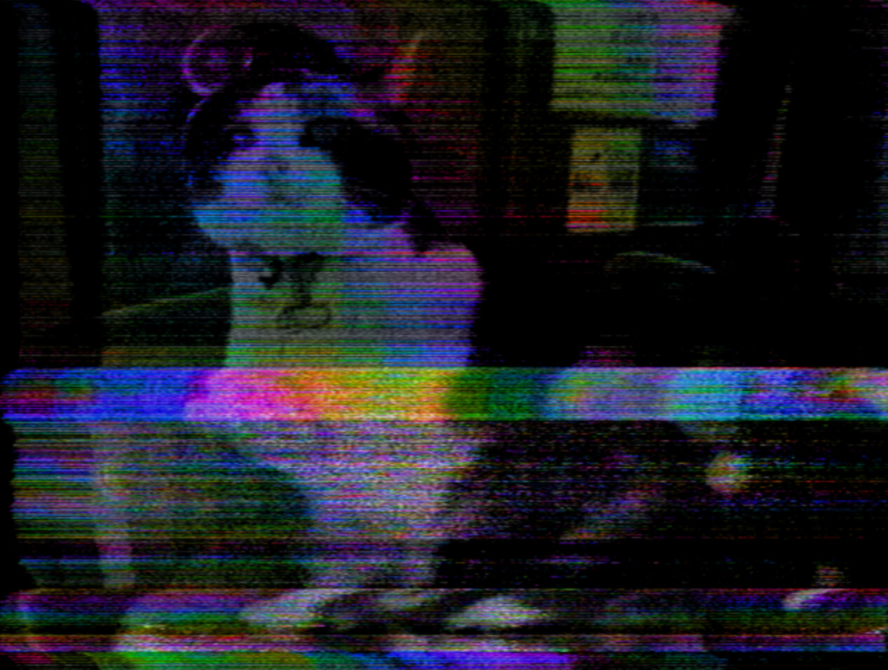

# ntsc.js

A TV you can break on purpose. The picture is encoded into a real NTSC
waveform, damaged the way tape, cable and a tired receiver damage one, then
decoded with the mistakes still in. Nothing here draws an artifact — you break
something upstream and watch what falls out.

Real-time in the browser, on WebGPU compute shaders.

### [**Try it live →**](https://cmdcolin.github.io/ntsc.js/)

Requires a WebGPU-enabled browser.

[](https://cmdcolinphotos.s3.amazonaws.com/phosphene/demo-v2.mp4)

## What's in it

- Every stage of the path, with the hardware fault behind each control: the
  wiring, the tape and RF, the receiver, the screen.
- Three feedback loops — a camera at the monitor, the mixer patched into
  itself, and a tape loop with up to four playback heads.
- Two sources, summed dirty or genlocked, with wipes and a chroma keyer.
- Any slider can run on an LFO, random walk, Lorenz attractor or live audio.
- MIDI learn and automap, with soft takeover and clock-locked rates.
- Record to webm or stills, or pop the controls into a second window and point
  OBS at the picture.
- The whole board fits in a URL, so a link is a patch. Works on a phone.

## Run

```
pnpm install
pnpm dev
```

Running locally adds a **YouTube…** source the hosted demo doesn't have.

## Docs

### [Read the docs site →](https://cmdcolin.github.io/ntsc.js/guide/)

[Getting started](docs/GETTING-STARTED.md) ·
[User guide](docs/USER-GUIDE.md) ·
[Effects](docs/EFFECTS.md) ·
[How it works](docs/HOW-IT-WORKS.md) — the code ·
[MIDI](docs/MIDI.md) ·
[Comparison](docs/COMPARISON.md)

---

Note: this project is extensively vibecoded. The initial signal-path design was
one-shotted by [Fable](https://claude.com/), which nailed the "signal level"
idea behind the glitches.
