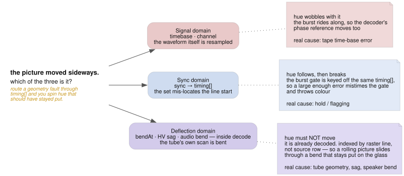

# ntsc.js architecture

Orientation for someone (or something) about to change this codebase. It covers
the shape of the system and the invariants that are easy to violate, not an
inventory of every file.

## The premise

ntsc.js simulates the NTSC signal path, not the _look_ of one. There is no "VHS
filter". A picture is encoded to a real composite waveform on a fixed raster,
damaged in the ways real hardware damages a waveform, then decoded by a model of
a TV that has to find sync in whatever it is handed. Dot crawl, rainbow
fringing, tearing, rolling and hue drift are **emergent** — nobody draws them.

That premise is the main design constraint: when adding an effect, prefer
modelling the mechanism that causes the artifact over drawing the artifact. The
payoff is that mechanisms interact for free, which is where the interesting
output comes from.

## The raster

Everything hangs off `src/signal/constants.ts`:

| quantity         | value                           |
| ---------------- | ------------------------------- |
| sample rate      | 4 × F_SC = 14.31818 MHz         |
| samples per line | 910 (= 227.5 subcarrier cycles) |
| lines per frame  | 525                             |
| active picture   | 754 × 480, starting at line 22  |
| line structure   | 67-sample sync tip, burst at 78 |

The composite signal lives in flat `array<f32>` buffers of 910 × 525 samples in
IRE units (sync −40, blank 0, black 7.5, white 100). Sample index `n = row * 910

- s`. Parameters are authored in **physical units** (µs, Hz, IRE) and converted
  to samples at the uniform-packing boundary — keep it that way.

The model is 525 lines per frame at 60 fps, i.e. progressive. Real NTSC is
interlaced at _field_ rate with a half-line offset, which is why vertical roll
currently steps a whole frame at a time. That is the largest remaining
authenticity gap.

## Pass order

One frame, driven by `Engine.render()` in `src/gpu/pipeline.ts`:

```
prePasses    compose → encodeYuv → encodeComposite → [feedA] → [composeB → encodeYuvB → encodeChromaB → encodeCompositeB → feedB → mixB] → [fbComposite] → [tapePlay → tapeRec]
loopPasses   chromaExtract → [underDown] → channel → timebase     (× dubGens, ≤ 4)
postPasses   [enhancer] → syncMeasure → sync → lineAnalyze → decode → crtFace → [storePrev]
present      render pass to the swap chain
```

That block is not decoration: `src/gpu/pipeline-graph.test.ts` parses the three
arrays out of `pipeline.ts` and fails if this order, or which names are
bracketed, no longer matches. `docs/graphviz/pipeline.dot` draws the same order
with the buffers on the arrows and is held to the same list.

Bracketed passes are gated by a `when()` predicate on the controls, so an idle
feature costs nothing. `loopPasses` runs once per tape-dub generation, with
per-generation params copied over the live buffers in between so each pass gets
its own noise and time-base walk.

The split matters: **encode** builds the waveform, **channel/timebase** damage
it, **enhancer/sync/decode** is the receiver trying to make sense of the damage.
An effect belongs in the stage that physically causes it. `enhancer` is an
outboard box between the deck and the set — it runs after the last dub
generation and before anything measures sync, so the pulses it stamps are the
pulses the receiver has to lock to.

**Each input also has its own feed** (`feedA`, `feedB`) — the deck, cable and
head-end between that one source and the mixer, so a fault there (scramble,
termination, snow, polarity, a ground loop, a loose plug, the pause button)
damages one signal alone and everything downstream reacts to the difference. The
two passes are one shader bound to different uniform buffers: `renderFrame`
packs each source's fault controls — and its paused deck's servo state — into
the standard damage fields of a second `Params` block, so each mechanism is
written once in `feed.wgsl` and reused fields cost no `PARAM_DEFS` growth.

That reuse sets one trap, and it is the trap to know before adding a per-source
fault. `packFeed` spreads the program-bus pack and overrides only the fields
`FEEDS` names, so **every other `Params` field reaches a feed still holding the
bus's value**. A block in `feed.wgsl` that reads a field nobody overrode applies
a program-bus knob to one source and looks like it works. The declaration is
therefore one table entry (`feedgates.ts`), one `packFeed` override, one shader
block, and one line in `feedFaults` — and `feedgates.spec.ts` fails if the last
is missed, because a fault the gate does not know about dispatches no pass and
its slider does nothing until some unrelated fault on the same input is up.

An engaged feed makes its encoder detour through the `compB` scratch (a
bind-group pair swapped off the same predicate that gates the feed). What makes
feedB possible at all is `encodeCompositeB`: B exists as a real composite on its
own raster, which `mix_b`'s dirty path then resamples — so B's damage, its pause
stripe included, rides B's raster through the slip and roll instead of parking
on the output.

## The three domains

The single most important distinction in this codebase, and the easiest to get
wrong. A horizontal displacement can come from three places, and they are _not_
interchangeable — what tells them apart is what happens to hue:

<picture>
  <source media="(prefers-color-scheme: dark)" srcset="img/domains-dark.svg">
  
</picture>

- **Signal domain** (`timebase`, `channel`) — the waveform itself is resampled.
  The burst moves with the picture, so decoder hue wobbles too. This is tape
  time-base error.
- **Sync domain** (`sync` → `timing[]`) — the receiver mis-locates the line
  start. The burst gate is keyed off the same `timing[]`, so it follows, and a
  large enough error mistimes the gate and throws colour off. This is hold /
  flagging.
- **Deflection domain** (`bendAt`, HV sag, audio bend, all inside `decode`) —
  the tube's own scan is bent, downstream of decoding. Hue must **not** move,
  and these are indexed by _raster line_, not source row, so a rolling picture
  slides through a bend that stays put on the glass.

Before adding a displacement, decide which domain causes it. Routing a geometry
fault through `timing[]` will spin hue that should have stayed put.

## Buffer layouts worth knowing

- **`timingBuf`** (`(LINES * 2 + 8)` floats) — `[0..524]` per-line horizontal
  offset; `[525]` vertical oscillator phase, signed and fractional; `[526]` PLL
  state; `[527]` AGC gain; `[528..531]` the two second-order gain servos (beam
  limiter and camera auto-iris, gain + velocity each — `sync` updates them,
  `decode` applies the ABL drive, `compose` applies the iris a frame late);
  `[532]` the sync separator's lock age, lines since the last real edge, which
  scales the free-running H-osc's phase noise so lock decays instead of
  coasting; `[SAG_BASE..]` normalized deflection sag per raster line. Indices
  525–532 are persistent across frames; treat them as state.
- **`lineParamsBuf`** — one `vec4f` per line from `LineState`:
  `(tbOffsetSamples, underBasePhase, underJitterPhase, seed)`. All four slots
  are taken; a new per-line CPU quantity needs its own buffer.
- **`syncMeasureBuf`** — one `vec4f` per line from `sync_measure`:
  `(sync edge or −1000, sync depth, mean beam load, broad-pulse flag)`.
- **`audioBuf`** — one float per line, the audio waveform at line rate.
- **`scopeBuf`** — the vectorscope's bins, `SCOPE_N`² `atomic<u32>`. The only
  buffer written by one shader stage and read by another _kind_: `decode`
  scatters into it and `present` reads it in a fragment shader. It decays rather
  than clearing (`scopeDecayPass`, run before the pre-passes when the scope is
  on), because a scope's trace is integrated by the instrument's own phosphor —
  clearing each frame would make it a one-frame sample that strobes on moving
  content. That pass is deliberately outside the three arrays above: it belongs
  to the instrument, not the signal path, and listing it there would claim the
  picture goes through it.

  Two traps here, both already paid for. `decode` views the buffer as
  `array<atomic<u32>>` and the decay pass as plain `array<u32>`, which is fine —
  but **a binding a shader never statically reads is dropped from the
  auto-derived layout**, so a dead uniform in the decay pass made its own bind
  group invalid and surfaced far away as `BindGroup with '' label is invalid`.
  `shaders.test.ts` now fails on an unread binding, which naga cannot see. And
  the decay changes what `present` is scaling: a steady trace settles at about
  four times its per-frame count, so the log mapping is calibrated for the
  accumulation rather than for one frame's hits.

- **`tapeBuf`** — the loop bin, `TAPE_FRAMES` (120) composite frames as f16
  pairs packed into `u32`, two seconds at 60 fps for 109 MiB. It is a _medium_,
  not a frame store: `tapeRec` writes the slot `frame % TAPE_FRAMES` and
  `tapePlay` reads it back through up to four heads at their own distances
  behind, so the same stretch of tape carries the same grain, the same worn
  patches and the same splice round after round. Two consequences to respect.
  **The delay arrives split** — `tapeDelayFrames` (whole frames) plus
  `tapeDelaySamples` (the remainder) — because the ring holds 57 M samples and
  an f32 stops counting integers singly at 2²⁴; position arithmetic in
  `tape_play.wgsl` is `u32` for the same reason. And **`tapePlay` must run
  before `tapeRec`**, which is what makes the maximum delay a full ring rather
  than one frame short of it — and is the thing to hold in mind when touching
  the hold window, because while recording frame _f_ the newest tape on the loop
  is _f−1_, so the window has to step on once more as the record head lifts or
  the last frame recorded is the one frame that never plays back.
- **`persistBufs`** — phosphor state (the light still on the glass), packed
  `rgba8`, ping-ponged by frame parity: `decode` reads one and writes the other,
  because its lateral scatter reads neighbouring pixels and a single buffer
  would hand it values the same dispatch is part way through overwriting.

## Params are generated, not hand-written

`PARAM_DEFS` in `src/gpu/prelude.ts` is the single source of truth for the
uniform struct: **field order there is the GPU memory layout**. It generates
both the WGSL `Params` struct and a typed `Record` that `packParams` consumes.
Adding a param to `PARAM_DEFS` without supplying it in `Engine.uniformValues()`
is a TypeScript error, by design — that is the guard against a silently-zero
uniform.

Adding a control end to end touches five files, and only the last is optional:

<picture>
  <source media="(prefers-color-scheme: dark)" srcset="img/controls-dark.svg">
  
</picture>

`PARAM_DEFS` has to come first — the type error it raises is what points you at
the remaining steps.

CPU-side per-frame state (`LineState`, `MixState`, `AudioState`) lives in
`src/signal/` and is either uploaded as a buffer or folded into uniforms.

## Direct-manipulation miniatures

A few controls describe a **position you can only judge on the output** — the
PiP inset window (`pipX/Y/W/H`), the wipe boundary (`wipePos`), and where the
magnifier is aimed (`crtZoomX/Y`). Those get a 4:3 miniature of the active
picture you drag on: `src/ui/PipFrame.tsx`, `WipeFrame.tsx` and
`MagnifierFrame.tsx`, over shared chrome in `MiniFrame.module.css` and the pure
geometry in `miniFrame.ts` (`lens.ts` for the magnifier).

The magnifier is also driven straight on the output: `Stage.tsx` turns a wheel
into `zoomAbout`, a drag into `panLens` or `zoomToBox`, and a double-click into
1x. All of it goes through `lens.ts`, which mirrors the transform in
`present.wgsl` — including the clamp that stops the lens looking past the edge
of the glass, so the miniature draws where the shader actually looks. That
mirroring is the thing to keep honest: change the transform in the shader and
`lens.ts` moves with it, or `lens.test.ts` starts lying.

Step 4 above still holds without exception: **every control keeps its slider.**
The miniature only hides the ones it duplicates, behind the group's `▸ sliders`
toggle. That is what keeps MIDI binding, clock sync, favorites, presets, scenes
and URL state working untouched — a miniature is another writer of a normal
control, never the only one.

The **fine tier** is the second sanctioned hider, under the same contract. A
`fine: true` on a `SliderDef` in `src/ui/controls.ts` marks a trim — a control
that shapes an effect some other control turns on — and `ControlGroup` folds
those rows behind a `▸ N fine tweaks` disclosure so a group's look-makers stay
scannable. Hidden, not removed: the row is one click away, a live filter
collapses the tier entirely so search and the ⌘K palette reach fine rows
directly, the group's touched dot and the phase roll-ups still walk every
slider, and the fold shows `· N touched` in the same amber when a preset has
moved something behind it. The tier is also the auto-map ranking (`AUTOMAP_KEYS`
puts non-fine controls first, then fine, then `VIEW_KEYS`), so a
knob-count-bound controller lands on look-makers first. Demotion criteria and
the vetoes that protect mode switches, preset-heavy keys and the
miniature-backed keys are pinned by `controls.test.ts`.

Two things to respect when adding another:

- **The frame is the shader's UV space** — 0..1 across the active picture, y
  down, the same `u`/`v` the pass computes. Anything the miniature draws or maps
  a drag through has to use the shader's own geometry. `WIPE_SHAPES` duplicates
  the pattern generator's distance functions from `mix_b.wgsl`, so
  `miniFrame.test.ts` pins them to the same values; change the pattern set in
  the shader and both sides move together or the test fails.
- **Don't draw what the engine is driving.** `wipeRate` sweeps `wipePos` inside
  `MixState` every frame, and the UI cannot see the effective value without
  re-rendering React at 60 fps (which the section above forbids). The frame
  marks the lever as driven instead of drawing a stale boundary.

Drags write through `writeControls` (one `applyControls`), so a gesture that
moves four controls is one notify, not four.

Nothing in a miniature may run per frame — no `rAF`, no transitions or
animations that recalc style each tick. The panel shares a main thread with a 60
fps canvas, and a decorative pulse measured 7 ms of style recalc per 3 s for
information a static border carries. Measure with `page.metrics()` deltas
(`RecalcStyleDuration`, `ScriptDuration`), not fps: the loop is vsync-capped, so
fps stays at 60 until the budget is already gone.

## Performance shape

Almost everything is comfortably parallel. Two exceptions:

- **`sync.wgsl` is `workgroup_size(1,1,1)`** — a single thread running two
  525-iteration loops (the PLL flywheel and the HV sag). It must be serial: each
  line's value depends on the previous line's. It is latency on one thread
  rather than GPU throughput, and it measures fine at 60 fps, but it is the one
  pass that cannot scale. Another per-line recurrence should be a parallel
  prefix-scan instead of a third loop here.
- **`decode` stages a shared tile per row.** A workgroup covers 64 pixels of one
  raster row and stages a contiguous span with a 32-sample halo, so the demod
  FIR reads workgroup memory. Consequence: horizontal offsets must be
  **row-uniform**. Per-pixel horizontal scaling (H size, linearity, pincushion)
  would read outside the halo and needs the staging restructured first.

## The React layer

React only ever configures the engine — it never renders a frame. The render
loop lives in `useEngine` and writes to the canvas directly, so live per-frame
state (fps stats, resolution) reaches the overlays as **mutable refs read during
render**, rather than re-rendering React at 60 fps.

**A lost device is rebuilt in place, not reloaded.** Sleep/wake and driver
resets fire `device.lost`, and they are the losses a session should survive:
`onDeviceLost` builds a replacement engine and hands it back the controls, the
debug tap, B's enable flag and both slots' sources, so the only thing the user
sees is a banner for the length of a `requestDevice` (measured well under 100 ms
on the dev box). Three consequences bind anything that touches this:

- **The outgoing engine stays the store until the swap.** React reads controls
  from the engine via `useSyncExternalStore`, so nulling `engineRef` during the
  gap would flash every slider to its default and lose any write made in the
  meantime. The dead engine keeps taking writes — they are plain JS — and the
  snapshot is copied across at the moment the replacement goes live.
- **The audio graph moves over rather than being rebuilt** (`Engine.create`'s
  `audio` option, `destroy({keepAudio: true})`). A media element binds to one
  `AudioContext` for life, so a fresh graph could never re-adopt the clips still
  playing — `createMediaElementSource` throws on the second call for an element.
- **Every source reaches a slot through `VideoSlot`'s three setters**, which is
  what makes the restore possible: `useEngine` records what each slot was last
  handed (`SlotSource`) and replays it. A live `<video>` is the browser's, not
  the device's, so a clip, a webcam or a screen share only needs re-attaching;
  only stills and noise fields are re-issued. Adding a fourth way to set a
  source without going through a slot would silently lose it across a loss.

What does _not_ come back is the content of VRAM — phosphor state, the frame
store and the tape loop all restart empty. `onHang` is deliberately **not**
rebuilt: a wedged GPU process is shared across tabs and outlives the page, so a
fresh device would land on the same one. That one still goes to `FatalScreen`.

**React Compiler is on** (`vite.config.ts`, via `reactCompilerPreset` and
`@rolldown/plugin-babel`). Don't add `useMemo`/`useCallback` — memoization is
the compiler's job. Two consequences worth knowing:

- **`App`, `Stage`, `InputSection` don't compile** — the ref-during-render
  pattern above is exactly what the compiler refuses. This is harmless in
  itself: a bail-out means the compiler leaves that code exactly as written.
  `useEngine` itself does compile (it only returns the refs, never reads one for
  render output within its own body) — the bail-out lives in its callers.
  oxlint's `react` plugin (`.oxlintrc.json`) has no rule equivalent to
  eslint-plugin-react-hooks' `refs` (which used to flag this on principle), so
  there's nothing to suppress; `react/rules-of-hooks` and
  `react/exhaustive-deps` still run and report real bail-outs.
- **What is load-bearing is that a callback held in a dep array keeps its
  identity.** `useClockSync` holds `writeControl` from `useMidi` in an effect
  dep array; if that closure got a fresh identity per render the effect would
  re-fire constantly and `midi.setExternal` would reset soft-takeover every
  render, so a physical knob could never hold its catch. `useMidi` therefore
  keeps hand-written `useCallback`s (`useMidi.ts:57`) rather than trusting the
  compiler — the invariant is correctness, so it is stated at the definition
  instead of inferred from build output. Note the consumer's own status is
  irrelevant: a compiled consumer still re-fires on a changed identity.

**Two panel contexts, deliberately.** `ControlsContext` carries the controls and
the verbs a row needs; `ModSlotsContext` carries the modulation bay. They are
separate because they change on completely different clocks — a slider drag
rewrites controls on every pointer move, while the bay changes only when someone
patches it — and one shared context would rebuild every consumer of both on each
drag frame.

The bay lives in React (`useModSlots`), never in the engine. `setModSlots` is
write-only by design: the engine applies routings by mutating `controls` for the
duration of one frame and restoring after (`pipeline.ts`, `applyMod`), so a
modulated value never comes back out of `getControls` — which is what keeps
presets, scenes, links and the sliders showing the resting look. Two
consequences worth knowing before touching it:

- **Slot position is identity.** `ModState` keys each wave's phase and its noise
  seed by the slot's index, so a stale routing must be blanked in place rather
  than filtered out; compacting hands one slot's running phase to another and
  restarts everything below it.
- **Modulating one of the five filter controls** (`encChromaMHz`, `demodMHz`,
  `chromaTail`, `lumaMHz`, `lumaPeak`) rebuilds the FIR bank every frame. Fine
  as a deliberate patch, which is why the UI allows it; not fine hanging off an
  authored preset, which is why `presets.test.ts` forbids it there.

To check what compiled, build unminified and look for the memo-cache preamble:

```sh
pnpm exec vite build --minify false
grep -n "import_compiler_runtime.c)(" dist/assets/*.js   # one per compiled fn
```

## Testing

- `pnpm test` — `src/gpu/shaders.test.ts` prepends the real prelude to every
  `.wgsl` and validates it with **naga**. WGSL is otherwise only compiled inside
  the browser, so a typo would survive until runtime. Naga is optional locally,
  enforced under CI. Plus unit tests for the pure DSP/envelope helpers.
- **Visual verification needs Firefox Nightly on Linux**, not Chrome — see
  `CLAUDE.md`. Chrome's ANGLE/Vulkan backend reports spurious texture-allocation
  errors that are driver artifacts. `scripts/shot.mjs` launches it with the
  right prefs; model new harnesses on it.
- The app exposes the engine as `window.vf`, and `?iurl=`, `?iurlb=`, `?preset=`
  and `?set=` configure a session entirely from the URL — so a harness never has
  to click the UI. `?dbg=` selects debug views (2 waveform, 3 luma, 4 chroma, 5
  burst state) which are the fastest way to isolate a stage.
- Occluded windows throttle `rAF`; call `window.vf.step()` to advance frames
  deterministically. Note that stepping in a tight loop makes the on-screen fps
  readout meaningless — measure perf with `rAF` running normally.

## Conventions

`CLAUDE.md` has the full set; the ones that bite hardest here:

- Never `git stash` — multiple agents share this worktree.
- Don't create feature branches unless asked.
- Debug by adding logging and proving a hypothesis, not by patching symptoms.
- Comments explain _why_ — the physical mechanism being modelled — not _what_.
