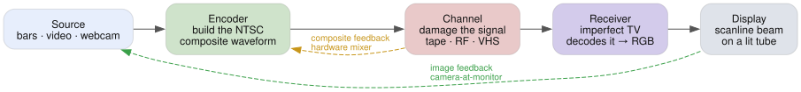

# Effects and features

Every control breaks a piece of hardware rather than drawing an artifact. Dot
crawl, rainbows, tearing and hue drift are what falls out — which is why two
controls compound instead of just stacking.

This page is the map. Every slider in the app carries a **?** explaining the
fault it models, and both the filter box and `ctrl+k` search that help text, so
you can find an artifact without knowing its knob.

<picture>
  <source media="(prefers-color-scheme: dark)" srcset="img/pipeline-simple-dark.svg">
  
</picture>

## Sources and wiring

Two decks. Either takes a still, a video file, a webcam, a shared screen,
colour bars, TV static, a video synth, or a teletype card you type on — plus
your own clip shelf and a roll out of Wikimedia Commons and archive.org.

Then the faults, starting at the connector: snow, a loose plug, a ground loop,
a termination fault, polarity flips, S-video miswired into composite. Cable
scrambling, Macrovision AGC pulses and colorstripe are the interesting corner —
they work by playing the receiver's own AGC and burst circuits against it.

Each input also has its own deck and cable ahead of the mixer, so a fault can
hit one source alone. Knock out one input's sync and the receiver locks to the
other, and the geometry snaps between two pictures.

## Feedback loops

Three, and they differ in what goes round.

**Camera at the monitor** — the lit tube face sent back optically, with zoom,
rotate, shift, defocus, vignette and an auto-iris that hunts.

**Mixer loop** — the composite waveform patched into itself. The subcarrier goes
round with it, which is why the delay doubles as a hue rotation and each
generation lands further round the wheel. Ring mod, luma keying and soft rails
are on the return.

**Tape loop** — a loop of tape with up to four playback heads. The return gets
recorded again, so repeats decay by generation loss rather than by a fader, and
chroma dies first.

## A/B mix

B genlocked onto A's raster for a clean dissolve, or summed dirty and
free-running against it, which is the two-deck rig. Ring mod, hue and gain
trims, wipes, a PiP inset, and a chroma key.

The keyer cuts the chroma the encoder made, and that filter has no vertical
term — so mattes come out soft across and razor sharp down, the way every
composite key was.

## Tape and channel

Everything between the recorder and the set. The whole stage runs up to four
times, one per dub generation.

- **Bandwidth** — luma from 4.2 MHz down to mush, and the peaking VCRs fake
  detail back with.
- **Nonlinearity** — differential gain and phase, FM over-deviation.
- **Noise** — tape grain, RF snow, hum bars, ghosting, sound-carrier buzz, and
  impulse noise from arcing.
- **The tuner** — weak signal, adjacent channel, fine tuning, CB ingress.
- **Colour-under** — VHS moves chroma to 629 kHz and back. Phase jitter, chroma
  noise and Y/C delay all follow from that trip.
- **Tape and heads** — dropouts and the compensator that patches them, tracking
  error, head clog, shuttle, flutter and wow, sticky shed, and head switch: the
  torn hook at the bottom of every VHS frame.

The one worth knowing: noise out of an FM discriminator rises toward the top of
the band, which lands it in the chroma passband, so tape noise arrives as
crawling coloured speckle rather than grey grain.

## Enhancer

A consumer enhancer between the deck and the set, with its jumpers moved. The
clamp gate slides off the back porch so black level bounces line to line; the
peaking coil gets feedback wrapped round it and rings; the sync regenerator
restamps pulses wherever its slicer crosses — bend that up into picture and
dark content starts minting sync of its own.

## Receiver

A television, and the ways one can be misadjusted. Sync faults move the
picture; decoding faults move its colour.

- **Sync and deflection** — AGC, horizontal and vertical hold, oscillator
  detune, retrace flag, deflection bend, V size, HV sag, beam limiter.
- **Colour decoding** — Y/C comb or notch trap, chroma bandwidth, tint, demod
  axis, burst lock, colour killer, chroma AGC lag.

Deflection bend happens after decoding, so it warps geometry but must not touch
hue. That distinction — whether a wobble takes the colour with it — is the one
worth having in front of the app.

## Screen

The beam (spot size, bloom, convergence, blanking strobe, scan velocity
modulation) and the phosphor (grain, selectable primaries, persistence, trail
scatter, a magnetised purity patch).

Persistence decays second-order rather than exponentially, so a trail is a
bright front over a long faint tail — and it goes green, because red and blue
die first.

## Audio-reactive

Audio patched into the electronics at one sample per scan line, driving the
faults above rather than adding new ones: bass into vertical hold and HV sag,
level into horizontal hold, the waveform into deflection or into the
demodulator's reference.

That last one turns the tint 15,734 times a second. The reference lives in the
receiver, so the colour bands stay on the glass while a rolling picture slides
through them.

## The rig

- **Modulation** — any control can run on an LFO, random walk, noise,
  sample-and-hold, a Lorenz attractor, audio, or a one-shot envelope. Depth is a
  fraction of that control's range, so the slider stays the centre and a preset
  still holds the look. Rates lock to a tapped BPM or MIDI clock.
- **MIDI** — any controller sending CC, with learn, auto-map and soft takeover.
  See [MIDI.md](MIDI.md).
- **Presets** — also faders you can drag partway in. Morph, random nudge, full
  undo, and saved profiles behind a sign-in.
- **Sharing** — the whole board mirrors to the URL, so a link is a patch.
- **Capture** — stills, webm recording, or pop the controls into a second window
  and point OBS at the picture.
- **Interface** — the chain map, a command palette, signal taps and an IRE
  scope, a magnifier that magnifies the tube face along with the picture.

---

[User guide](USER-GUIDE.md) for how to drive it ·
[How it works](HOW-IT-WORKS.md) for the code.
