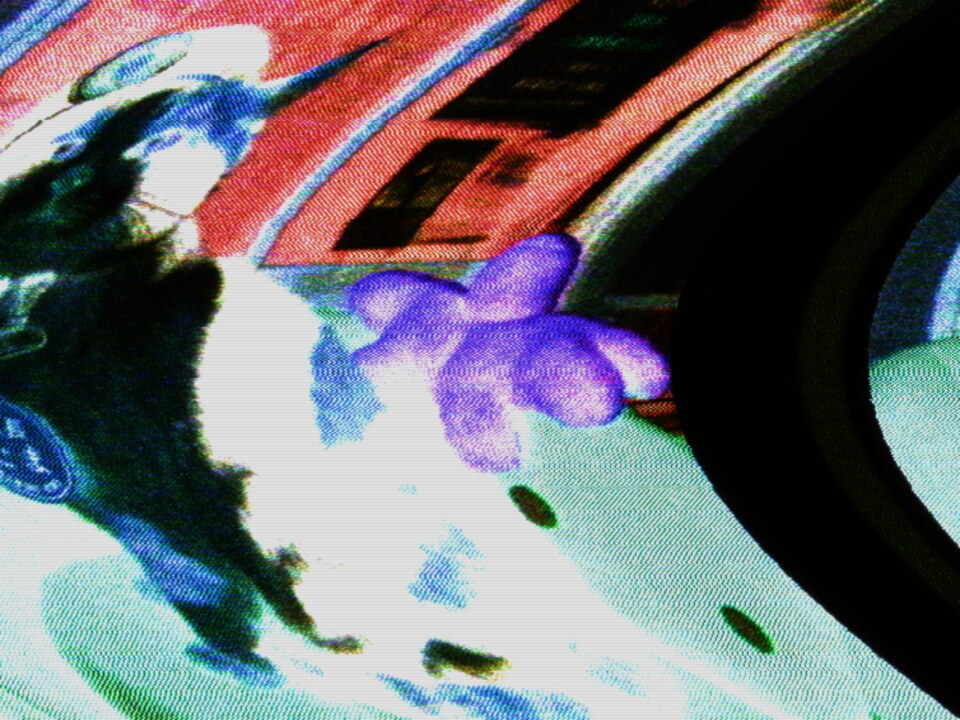
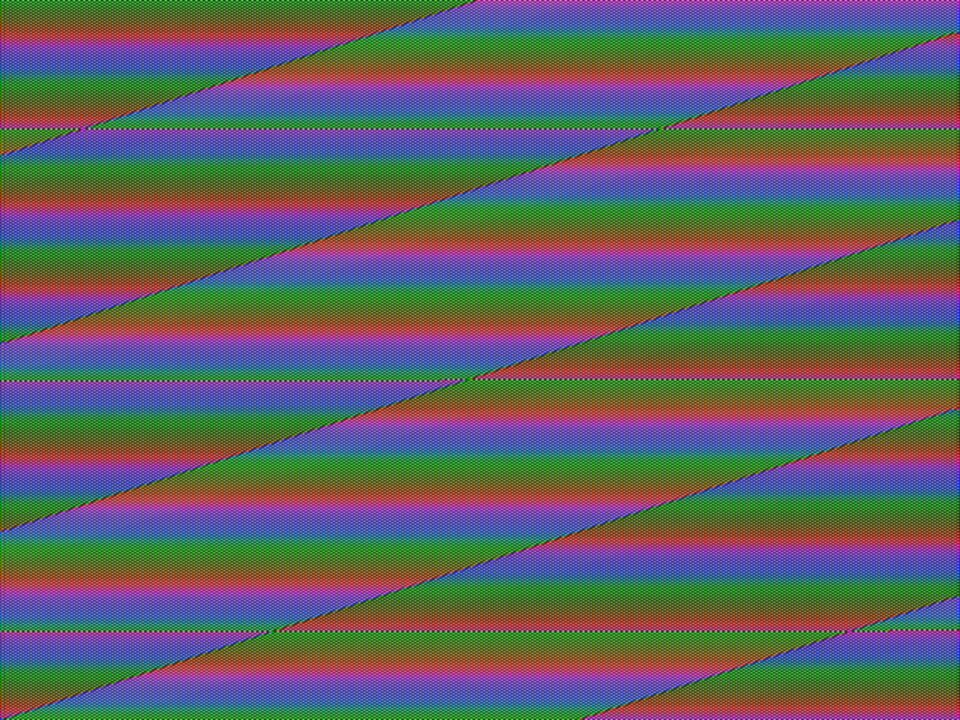
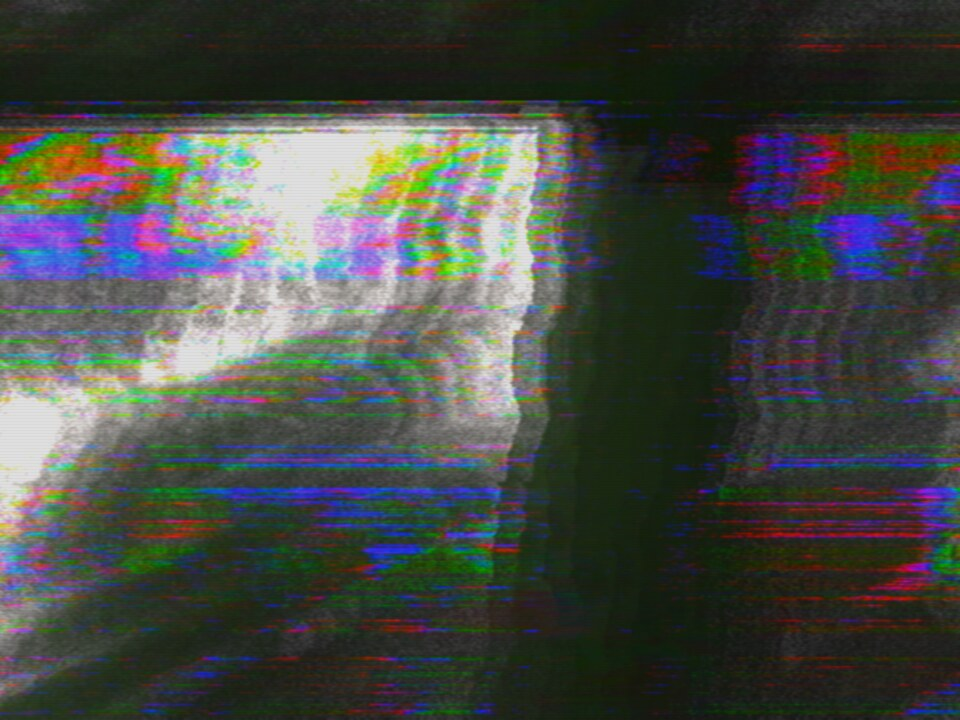

# Getting started

ntsc.js is a TV you can break on purpose. It encodes the picture into a real
NTSC waveform, damages it the way tape, cable and a tired receiver do, then
decodes it with the mistakes still in. You don't draw artifacts here. You break
something upstream and watch what falls out.

It runs in a browser with WebGPU (Chrome, Edge, Safari 26+, or Firefox Nightly
on Linux). There's nothing to install.

<video
  controls muted loop playsinline
  poster="img/clip-hero-poster.jpg"
  src="https://cmdcolinphotos.s3.amazonaws.com/phosphene/clip-hero.mp4"></video>

[Open this patch ↗](https://cmdcolin.github.io/ntsc.js/?src=cat&srcb=cat&set=chromaGain%3A2.4%2CsvideoBleed%3A0.8%2CchromaTail%3A0.4%2CencChromaMHz%3A1.85%2CdemodMHz%3A1.23%2ChHold%3A0.35%2CvHold%3A0.4%2CvFreqHz%3A59.6%2CsyncBendUs%3A6%2CbendUs%3A22%2CbendShape%3A2%2ChvSagUs%3A12%2ChvRing%3A0.8%2ChDetuneHz%3A24%2Cscramble%3A0.4%2Cagc%3A0.5%2CnoiseIre%3A7%2CenhPeakMHz%3A0.35%2CenhPeakQ%3A0.7%2CenhPeakBoost%3A0.06%2CfbMix%3A0.5%2CfbZoom%3A1.03%2CfbRotateDeg%3A2%2CfbGain%3A0.96%2CfbFocus%3A1.1%2CfbVign%3A0.4%2CfbBlack%3A0.02%2CfbKnee%3A0.6%2CcfbMix%3A0.35%2CcfbGain%3A0.8%2CcfbDelayUs%3A0.25%2CcfbLines%3A3%2CcfbKey%3A0.7%2CcfbKeyLevel%3A45%2CcfbKeySoft%3A10%2CbGain%3A0.35%2CbLineHz%3A0.71%2CbDetuneHz%3A107%2CbRollLps%3A0.17%2Cphosphor%3A0.45)

## Four steps

1. **[Open the app ↗](https://cmdcolin.github.io/ntsc.js/)**. It starts on a
   bundled photo.
2. **Click a preset.** The board jumps to that look. Drag one sideways instead
   and it only goes in part of the way.
3. **Give it your own footage.** Open Source A at the head of the signal path
   and pick a file, a webcam, a screen share, or a random clip out of Wikimedia
   Commons or archive.org.
4. **Hit random nudge** a few times. It keeps the look you have and jogs every
   control a little, which is where most of the good accidents come from.
   `ctrl+z` takes any of it back.

When you find something worth keeping, hit **⧉ copy link**. The whole board
lives in the URL, so a link is a patch.

## What's on screen

**1** the picture, where a drag boxes a region to magnify and a double-click
pulls back · **2** the ☰ menu, for stills, recording, fullscreen and settings ·
**3** presets · **4** the way into every control, sources included.

Controls sit where they belong on the signal path. The chain map at the top of
the sidebar is that path, and every box on it is a button.

## Three looks to try

|                                                                                          |                                                                                           |                                                                            |
| :--------------------------------------------------------------------------------------: | :---------------------------------------------------------------------------------------: | :------------------------------------------------------------------------: |
|  |  |  |

**negative** reverses polarity on the composite line, and sync goes with it ·
**key sweep** runs the video synth through the chroma keyer, with no camera
anywhere in it · **mixer loop** patches the composite into itself past unity,
where it stops returning your picture and starts breeding its own.

## Where next

- [User guide](USER-GUIDE.md) — sources, feedback, modulation, saving, scopes
- [Effects & features](EFFECTS.md) — everything it can break
- [How it works](HOW-IT-WORKS.md) — the code: one array and a chain of GPU
  shaders
- [MIDI](MIDI.md) — setting up a controller
