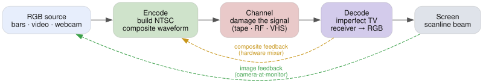
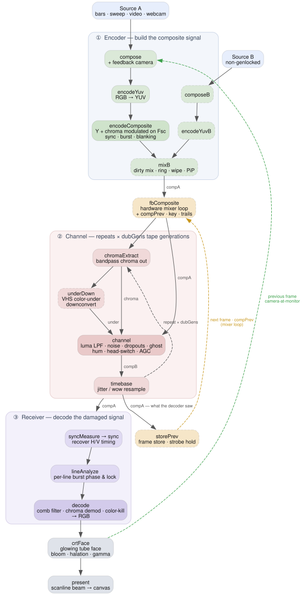

# How it works

The picture is never handled as an image. Each frame, the RGB source is turned
into a real NTSC composite waveform — a 1D voltage signal sampled at four times
the color subcarrier, about 478,000 samples a frame (910 per line, 525 lines).
Every "glitch" is just what happens when you rough that signal up and decode it
with an imperfect receiver.

## If you write JavaScript, here's the shape of it

That waveform is really just one big `Float32Array` — those ~478k samples —
sitting in GPU memory (the `compA` buffer) and never coming back to the CPU. In
plain JS, one stage of damage would be a loop:

```js
for (let i = 0; i < signal.length; i++) out[i] = mangle(signal, i)
```

478k iterations, times a dozen stages, 60 times a second — hopeless on one CPU
thread. WebGPU keeps the exact same idea but runs the _body_ of that loop for
every `i` at the same time, spread across thousands of GPU cores. Each stage of
the chain is one such pass: a small program (a `.wgsl` _shader_) that reads the
buffer and writes it back, with the GPU supplying the `i`. There is no visible
loop — you write only `mangle`, and the hardware fans it out over all the
samples.

The CPU barely does any signal math. Once per animation frame it uploads the
source frame to a texture, writes the current slider values into a small
uniforms buffer, records the whole list of passes, and submits it in one go. No
`await`, nothing read back.

Kicking off a pass is `dispatchWorkgroups(x, y)` — basically the bounds of that
parallel for-loop, in 2D: `y` counts the 525 lines, `x` counts the samples
across a line (in groups of 64). A "bind group" is just the list of buffers a
pass is wired to — its arguments.

The passes hand data to each other through those shared buffers. Most read
`compA` and overwrite it in place; a few can't safely read and write the same
buffer at once, so they read from `compA` and write into `compB`, then swap. The
only thing that ever leaves the GPU is the final image the `present` pass draws
to the canvas. So the pipeline really is just an ordered array of passes, each
one a `.wgsl` shader in `src/gpu/shaders/`, wired up in `src/gpu/pipeline.ts`.
The filters they run are windowed-sinc FIR kernels designed from real MHz specs
in `src/signal/filters.ts`.

## The chain

Five blocks: source, encode, damage, decode, display. Two feedback loops fold
back in every frame.

<picture>
  <source media="(prefers-color-scheme: dark)" srcset="pipeline-simple-dark.svg">
  
</picture>

Same thing pass by pass, in the order they actually run (the channel block
repeats once per dub generation):

<picture>
  <source media="(prefers-color-scheme: dark)" srcset="pipeline-dark.svg">
  
</picture>

<sup>Dashed boxes are passes that only run when their control is engaged.
Diagrams are Graphviz: [`pipeline-simple.dot`](pipeline-simple.dot),
[`pipeline.dot`](pipeline.dot). `pnpm run docs` regenerates both in light and
dark variants (needs `dot` on PATH).</sup>

| Stage     | Pass(es)                                                   | What it models                                                                                                                                          |
| --------- | ---------------------------------------------------------- | ------------------------------------------------------------------------------------------------------------------------------------------------------- |
| Encoder   | `compose`, `encodeYuv`, `encodeComposite`                  | RGB → YUV → composite: luma + chroma quadrature-modulated onto the `Fsc` subcarrier, sync/burst/blanking inserted                                       |
| Dirty mix | `composeB`, `encodeYuvB`, `mixB`                           | second non-genlocked source B mixed/wiped into the finished composite, with its own hue/ring/detune                                                     |
| Channel   | `chromaExtract`, `underDown`, `channel`, `timebase`        | the tape/RF path — color-under, band-limiting, noise, dropouts, ghosting, hum, head-switch bend, time-base jitter. Loops once per **dub generation**    |
| Receiver  | `enhancer`, `syncMeasure`, `sync`, `lineAnalyze`, `decode` | an outboard box plus a real (imperfect) TV: sharpening/pulse-shaping, then sync recovery, per-line burst lock, comb filtering, chroma demod, color-kill |
| Display   | `crtFace`, `present`                                       | the lit tube face — bloom, halation, gamma — then the scanline beam profile to the canvas                                                               |

## The two feedback loops

They fold back at different points in the chain:

- **Camera-at-monitor** (in the image): before re-encoding, `compose` reads back
  the _previous_ frame's CRT face — `crtFace`'s glowing tube, the same texture
  the canvas shows — and zooms, rotates, shifts, and dims it. It's the same
  thing as aiming a camera at the screen it's driving, and it photographs an
  emissive screen rather than the raw decoder output.
- **Hardware mixer** (in the signal): `storePrev` stashes the waveform the
  decoder _saw_ — damaged composite, after the tape/RF path and the enhancer —
  in `compPrev`, then `fbComposite` blends it back into the next frame's
  composite with keying and trails. Feeding back at the signal level means it
  dot-crawls and smears like a real vision mixer.

---

[`ARCHITECTURE.md`](ARCHITECTURE.md) picks up from here: the pass graph, buffer
layouts, the three domains, and how to add a control end to end.
[`EFFECTS.md`](EFFECTS.md) goes the other way, down to each individual control
and the fault behind it.
