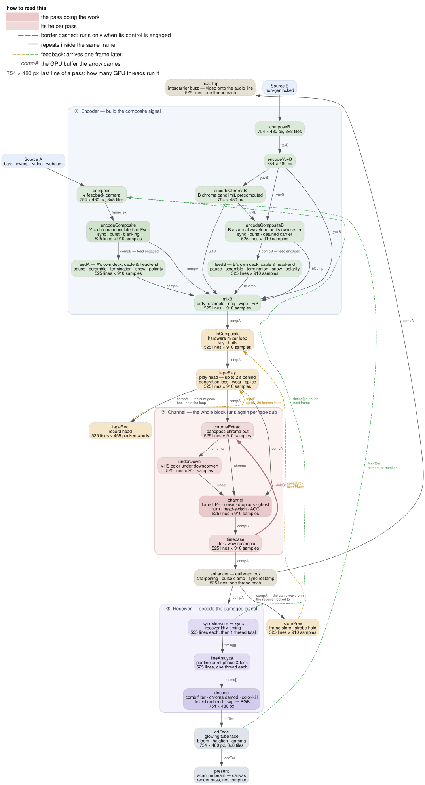

# How it works

The picture is never handled as an image. Each frame, the RGB source is turned
into a real NTSC composite waveform — a 1D voltage signal sampled at four times
the colour subcarrier, about 478,000 samples a frame (910 per line, 525 lines).
Every "glitch" is what happens when you rough that signal up and decode it with
an imperfect receiver.

## In JavaScript terms

The waveform is one big `Float32Array` in GPU memory that never comes back to
the CPU. One stage of damage would be
`for (let i = 0; i < signal.length; i++) out[i] = mangle(signal, i)` — 478k
iterations, a dozen stages, 60 times a second, which is hopeless on one thread.
WebGPU runs the body of that loop for every `i` at once. Each stage is one pass:
a `.wgsl` shader that reads the buffer and writes it back, with the GPU
supplying the `i`.

The CPU does almost no signal math. Once a frame it uploads the source texture,
writes the slider values into a uniforms buffer, records the passes and submits
them. Nothing is read back except the final image the `present` pass draws.

Kicking a pass off is `dispatchWorkgroups(x, y)`, which is the bounds of that
parallel loop in 2D: `y` counts the 525 lines and `x` counts samples across a
line, in groups of 64. A bind group is the list of buffers the pass is wired to,
so it's the argument list.

Passes hand data to each other through shared buffers. Most read `compA` and
overwrite it in place; `compB` exists only because `channel` can't read and
write one buffer at once. Alongside those runs a handful of small state buffers
— the per-line timing the sync separator recovers, the servo state for the beam
limiter and the auto-iris, the audio at line rate — and one big one, the tape
loop's two-second ring of composite frames, which is a medium rather than a
frame store: the same stretch of tape carries the same grain and the same worn
patches round after round.

## Why it can be played rather than rendered

Because the passes stay resident on the GPU, moving a slider is a write into a
uniform buffer. Nothing recompiles and nothing re-renders from scratch — the
next frame simply reads different numbers. That's the whole reason there can be
this many controls, all live at once, and it's what separates this from a
file-based tool.

Two places don't parallelise, and they shape what can be added:

- `sync.wgsl` runs on a **single thread**, because a PLL is a flywheel: each
  line's phase depends on the line before it. It's latency on one core rather
  than GPU throughput, and it's the one pass that can't scale.
- `decode` stages a shared tile per row, so horizontal offsets have to be
  **uniform across a line**. Per-pixel horizontal scaling — H size, linearity,
  pincushion — would read outside that tile and needs the staging rebuilt first.

The pipeline itself is an ordered array of passes in `src/gpu/pipeline.ts`, each
one a shader in `src/gpu/shaders/`, with the FIR filters designed from real MHz
specs in `src/signal/filters.ts`. For the full pass graph, the buffer layouts
and what it takes to add a control end to end, see
[`ARCHITECTURE.md`](ARCHITECTURE.md).

## The chain

Five blocks — Source, Encoder, Channel, Receiver, Display — with feedback
folding back in every frame.

<picture>
  <source media="(prefers-color-scheme: dark)" srcset="img/pipeline-simple-dark.svg">
  
</picture>

The same thing pass by pass, in the order they run. Every arrow is labelled with
the buffer it carries:

<picture>
  <source media="(prefers-color-scheme: dark)" srcset="img/pipeline-dark.svg">
  
</picture>

The diagram carries its own key, and a unit test asserts it draws exactly
the passes the engine builds. Sources are Graphviz —
[`pipeline-simple.dot`](graphviz/pipeline-simple.dot),
[`pipeline.dot`](graphviz/pipeline.dot), [`domains.dot`](graphviz/domains.dot),
[`controls.dot`](graphviz/controls.dot); `pnpm run docs` regenerates every
diagram in light and dark (needs `dot` on PATH).

| Stage     | Pass(es)                                            | What it models                                                                                                                                 |
| --------- | --------------------------------------------------- | ---------------------------------------------------------------------------------------------------------------------------------------------- |
| Encoder   | `compose`, `encodeYuv`, `encodeComposite`           | RGB → YUV → composite: luma plus chroma quadrature-modulated onto the subcarrier, with sync, burst and blanking                                |
| Dirty mix | `composeB`, `encodeYuvB`, `mixB`                    | a second, non-genlocked source mixed or wiped into the finished composite, with its own hue, ring mod and detune                               |
| Loops     | `fbComposite`, `tapePlay`, `tapeRec`                | the mixer loop blending back the waveform the decoder saw a frame ago, and the tape loop's play and record heads across the bus                |
| Channel   | `chromaExtract`, `underDown`, `channel`, `timebase` | the tape/RF path: colour-under, band-limiting, noise, dropouts, ghosting, hum, head switch, timebase jitter. Loops once per **dub generation** |
| Enhancer  | `enhancer`                                          | an outboard box between deck and set: sharpening, clamping, sync restamping. Runs before anything measures sync                                |
| Receiver  | `syncMeasure`, `sync`, `lineAnalyze`, `decode`      | an imperfect TV: sync recovery, per-line burst lock, comb filtering, chroma demod, colour kill, deflection bend                                |
| Display   | `crtFace`, `present`                                | the lit tube face — bloom, halation, gamma — then the scanline beam profile to the canvas                                                      |

## The three feedback loops

- **Camera at monitor** (image domain) — before re-encoding, `compose` reads
  back the previous frame's lit tube face and zooms, rotates, shifts and dims
  it. It photographs an emissive screen, not the raw decoder output.
- **Hardware mixer** (signal domain) — `storePrev` stashes the damaged composite
  the decoder saw, and `fbComposite` blends it into the next frame with keying
  and trails. Feeding back at signal level means it dot-crawls and smears like a
  real vision mixer.
- **Tape loop** (signal domain, but through a medium) — `tapeRec` writes the bus
  onto a ring of composite frames and `tapePlay` reads it back through up to
  four heads at their own distances behind. The return is recorded again, so a
  repeat is a real generation older rather than a fader's worth quieter.

## Three ways to move the picture sideways

A horizontal displacement can come from three different places, and they aren't
interchangeable. What tells them apart is what happens to the colour.

<picture>
  <source media="(prefers-color-scheme: dark)" srcset="img/domains-dark.svg">
  
</picture>

- **Signal** — the waveform itself is resampled, so the burst moves with the
  picture and hue wobbles too. This is tape time-base error.
- **Sync** — the receiver mis-locates the line start. The burst gate follows it,
  and a large enough error mistimes that gate and throws the colour off. This is
  hold and flagging.
- **Deflection** — the tube's own scan is bent, after decoding, so hue must not
  move at all. These are indexed by raster line rather than source row, which is
  why a rolling picture slides through a bend that stays put on the glass.

It's the distinction most worth having before you touch anything here: route a
geometry fault through the sync path and it will spin hue that should have
stayed still.

---

[`EFFECTS.md`](EFFECTS.md) goes the other way from here, down to each control
and the fault behind it. [`ARCHITECTURE.md`](ARCHITECTURE.md) goes further in,
to the pass graph, the buffer layouts and the invariants worth knowing before
changing any of it.
