# User guide

ntscenery is a TV you can break on purpose. It encodes the picture into a real
NTSC waveform, damages it the way tape, cable and a tired receiver do, then
decodes it with the mistakes still in. You don't draw artifacts — you break
something upstream and watch what falls out.

Every figure here is captured from the running app by
[`scripts/docshots.mjs`](../scripts/docshots.mjs), so the guide can't drift from
the UI.

<video
  controls muted loop playsinline
  poster="img/clip-feedback-poster.jpg"
  src="https://cmdcolinphotos.s3.amazonaws.com/phosphene/clip-feedback.mp4"></video>

## What's on screen

**1** the picture — drag a box on it to magnify, double-click to pull back ·
**2** the stage menu — stills, recording, fullscreen, settings · **3** presets ·
**4** input, A and B · **5** the way into all ~130 controls.

## Start with a preset

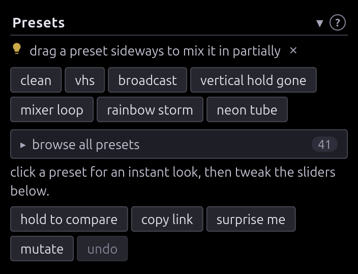

Click one and the board jumps to that look. Every preset is also a fader: drag
it sideways instead and it goes in _partially_, stacking onto what's there.

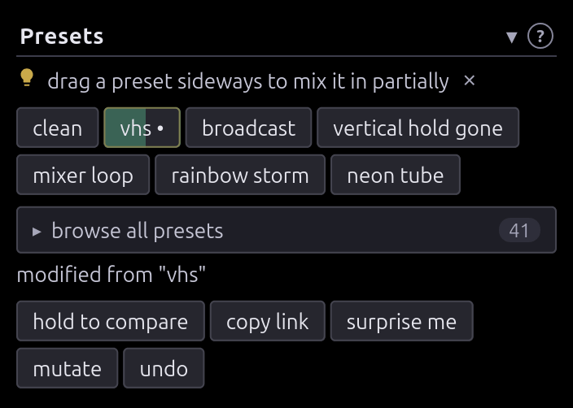

`clean` resets. **undo** (`ctrl+z`) steps back. **hold to compare** (or hold
`c`) previews the clean signal. **surprise me** stacks random presets;
**mutate** jitters everything a little, which is where the accidents come from.

Six rolls of **surprise me**, each one a link you can open and keep pushing:

|                          |                          |                          |
| :----------------------: | :----------------------: | :----------------------: |
| 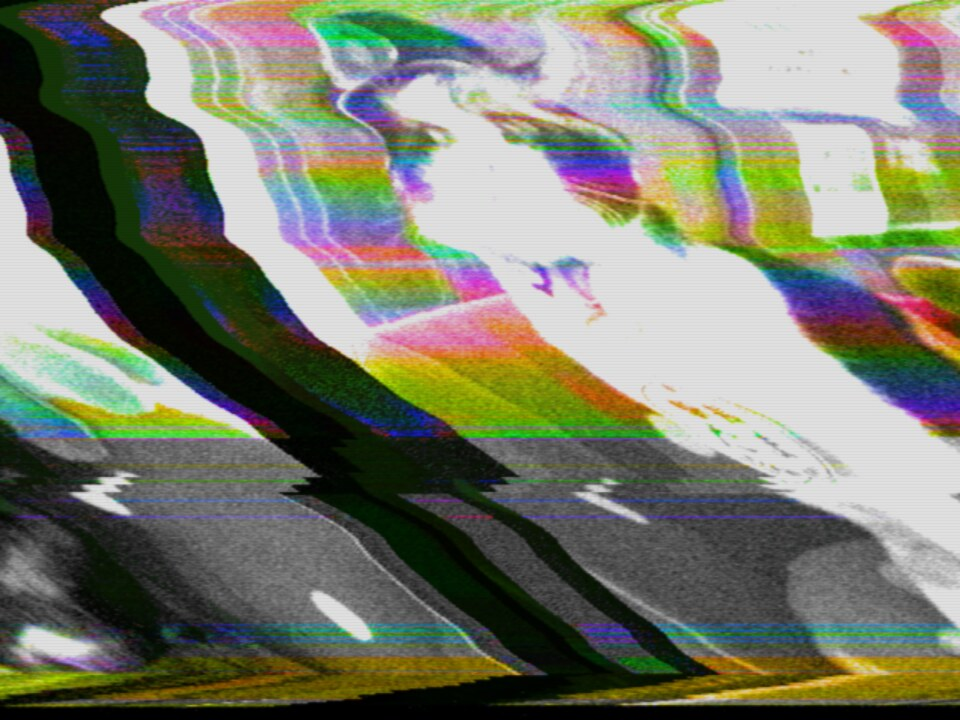 | 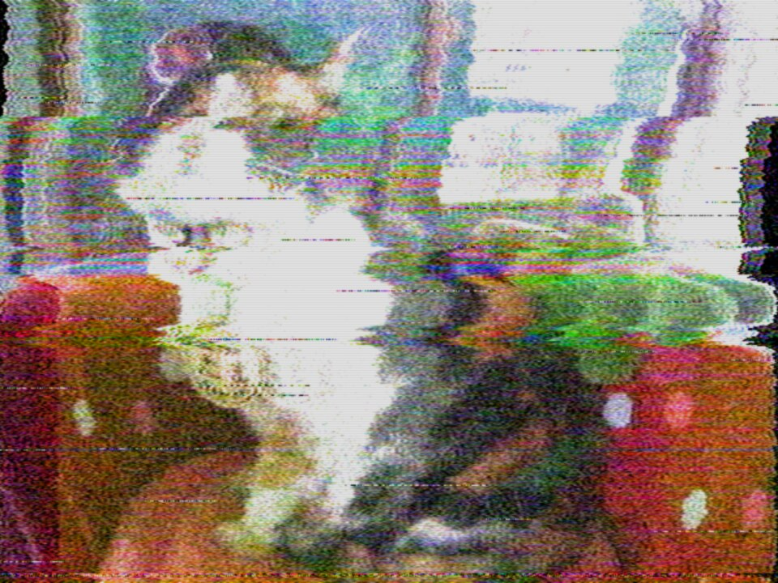 | 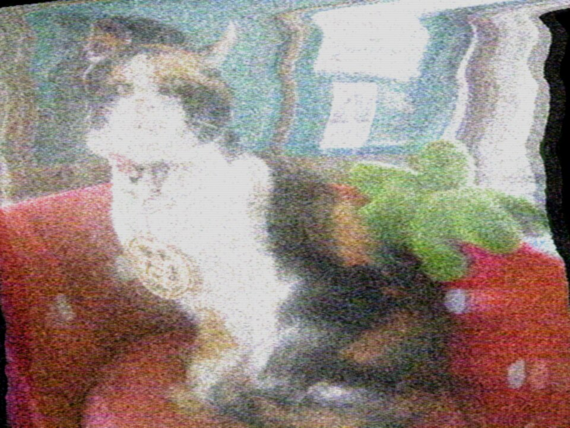 |
| 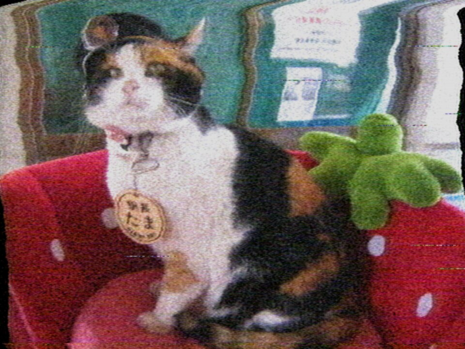 | 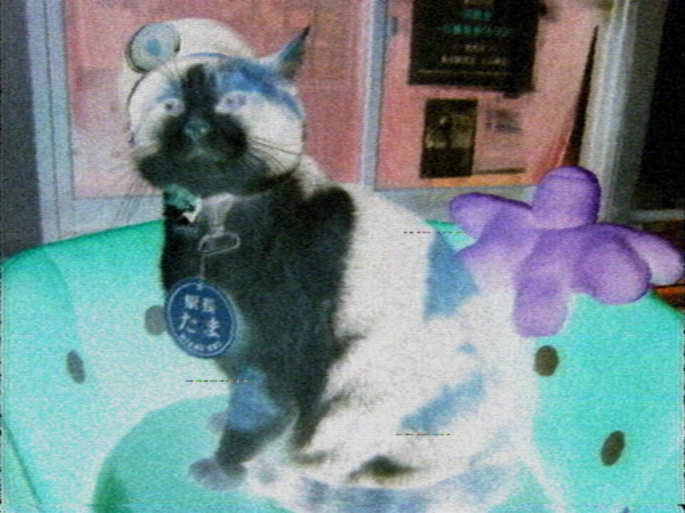 | 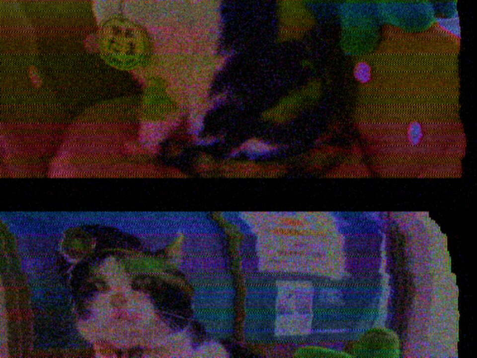 |

## Give it something to mangle

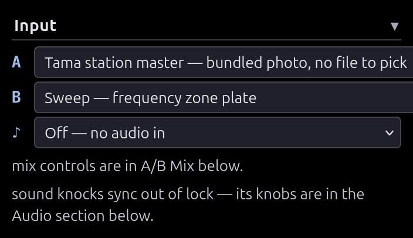

**A** is the main source: bars, sweep, snow, the bundled photo, a file of your
own, or a webcam — which is also how an RCA capture dongle gets real gear in
here. **B** is a second source, deliberately not genlocked, so mixing it in
beats and tears against A; its controls appear in **A/B Mix**. **♪** is audio
in, which does nothing until you turn up a knob in **Sound into the picture**.

Running locally adds a **YouTube…** source (`yt-dlp` on the dev server); the
hosted build has no server to do that with.

## Working down the chain

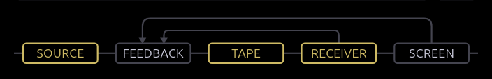

Controls live where they sit in the signal path, not in one long list. The map
at the head of the sidebar is the whole path — five stages, plus the two loops
that feed the picture back into it. Amber is a stage you've moved something in.
Click one to open its controls below:

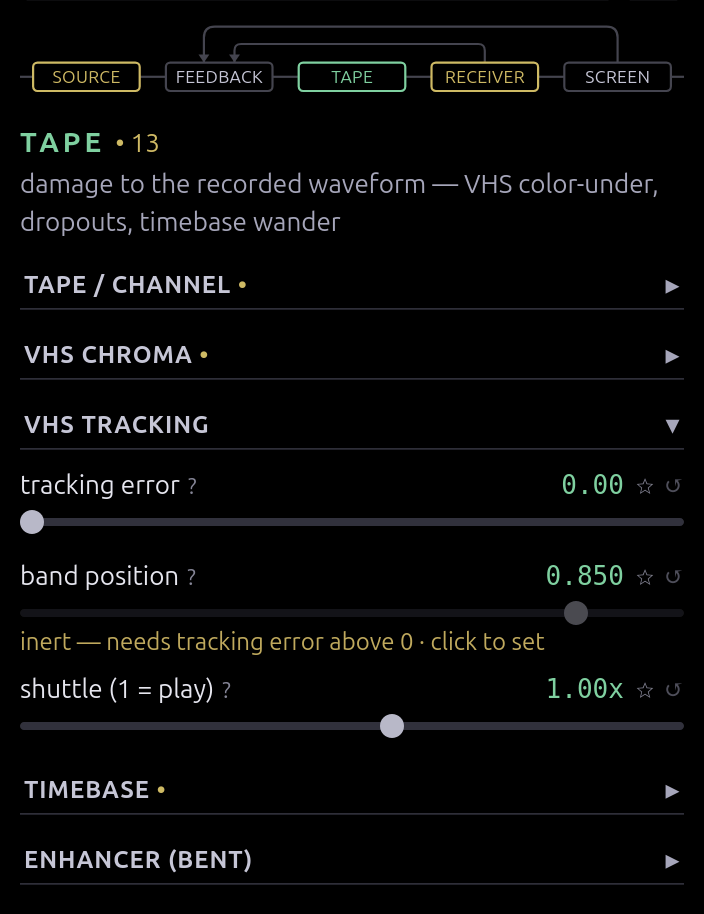

- **• 10** counts what you've moved in that stage; click it to jump there.
- **?** on any slider explains the fault it models — hover for a line, click for
  the card. **↺** resets it, **☆** pins it to Favorites at the top.
- **"inert — needs …"** means another control gates this one. Click the note to
  set it.

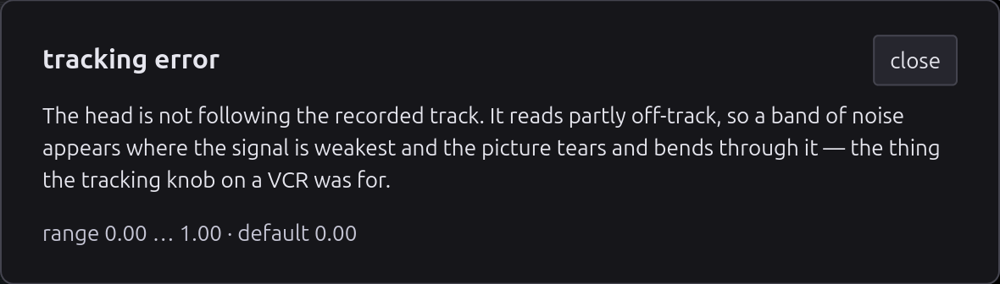

The help says what breaks in the hardware, not what you'll see — the look is
emergent, and the cause is what tells you how two controls will combine. All of
them are listed in [EFFECTS.md](EFFECTS.md).

## Finding a control

Both searches cover the help text, so you can hunt an artifact without knowing
the knob. The filter box narrows the panel:

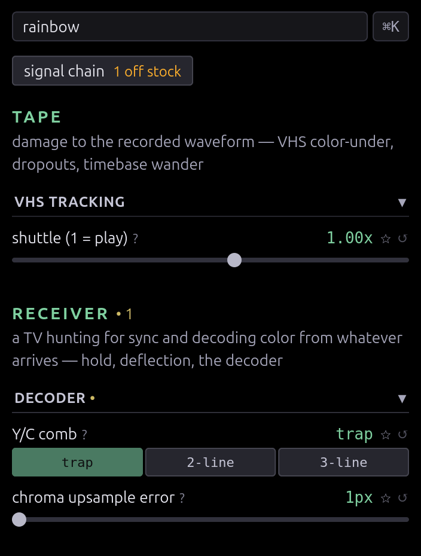

`ctrl+k` opens the palette over presets, controls and actions at once; `←→`
nudges the highlighted control live.

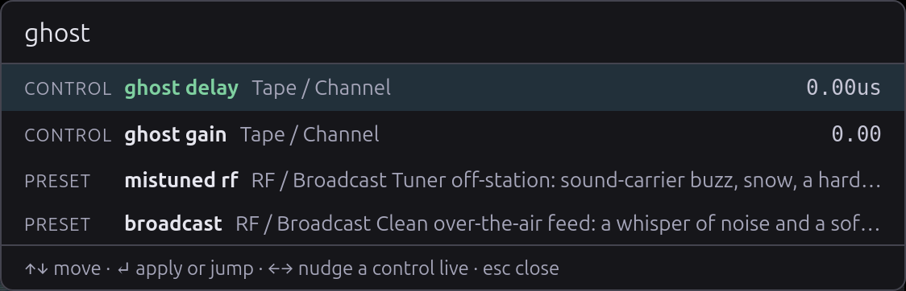

## Making it move

**Modulation** — four slots wiring an LFO, random walk, sample-and-hold, Lorenz
attractor or the audio envelope onto any control. Depth is a fraction of that
control's own range, and the slider stays put while modulation moves around it.

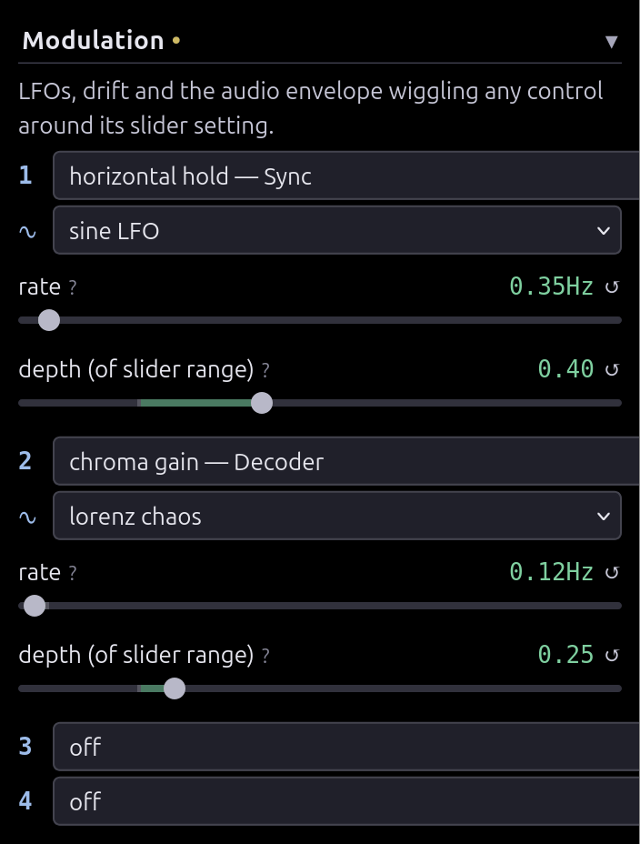

<video
  controls muted loop playsinline
  poster="img/clip-modulation-poster.jpg"
  src="https://cmdcolinphotos.s3.amazonaws.com/phosphene/clip-modulation.mp4"></video>

**Sound into the picture** — audio into the hold and deflection circuits: bass
lurches the frame, level tears line hold, the waveform draws itself on the
screen.

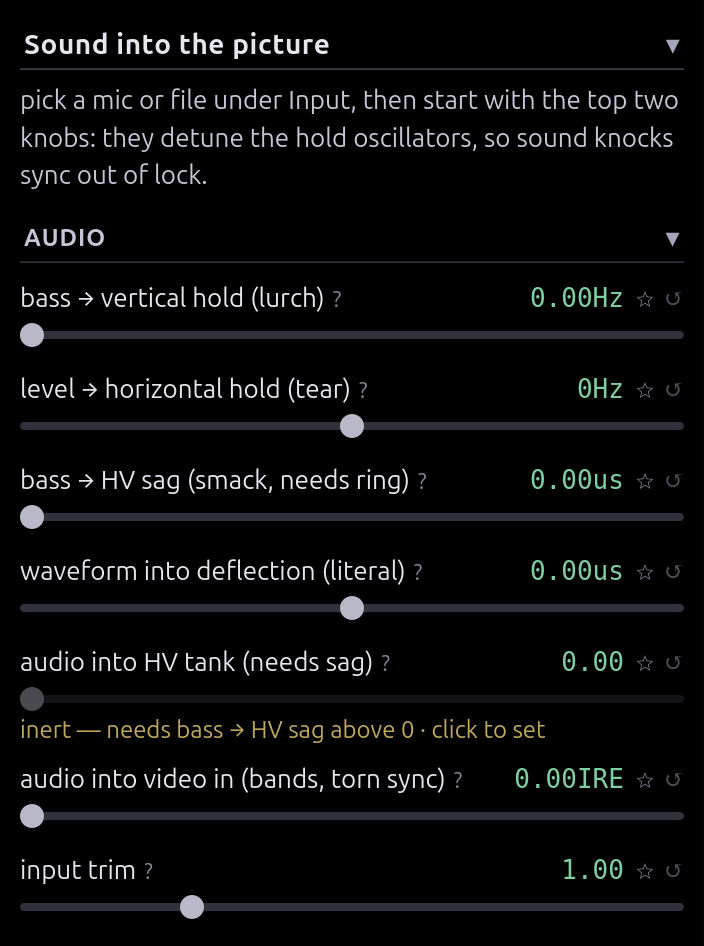

**MIDI** — the real answer if you want to play this. Automap or learn one knob
at a time, no jumps when a knob is out of position, rates locked to clock. See
[MIDI.md](MIDI.md).

## Keeping what you find

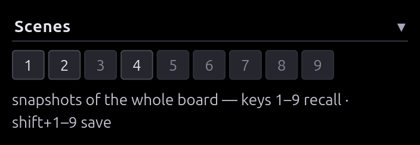

Nine scene slots for the whole board: `shift+1–9` saves, `1–9` recalls. **copy
link** puts the entire look in a URL — a link is a patch. `s` saves a still, `r`
records a clip.

## Looking closer

Drag a box to zoom, drag to pan once you're in, double-click to reset. The
magnifier is part of the display, so it magnifies the lit tube face — scan
lines, mask and all.

To watch the signal instead of the picture, pick a tap in **advanced settings**:
the composite waveform, luma, chroma energy, or the decoder's burst state.

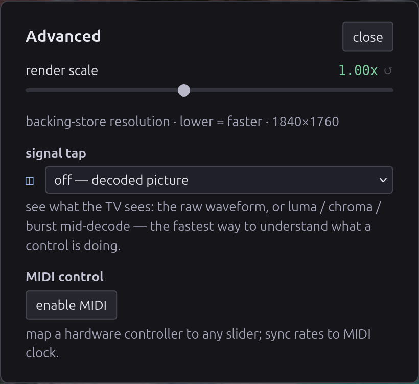

Turning a knob and watching the waveform change shape is the fastest way to
understand it. **render scale** in the same dialog trades resolution for frame
rate.

## Getting it out

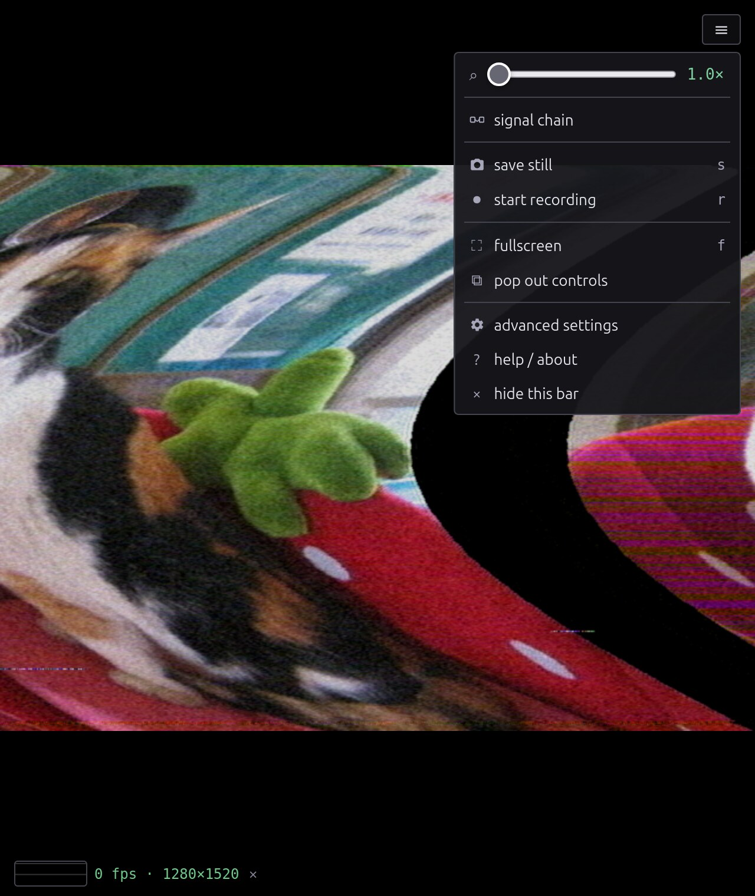

Everything that isn't a signal control lives here: stills, recording,
fullscreen, and **pop out controls**, which moves the panel to a second window
and gives the picture the screen. For anything you care about, point OBS at the
window — it beats the in-browser recorder and follows the magnifier at full
resolution.

## Keyboard

| Key                     | Does                                                |
| ----------------------- | --------------------------------------------------- |
| `ctrl/⌘+k`              | command palette                                     |
| `c` (hold)              | preview the clean signal                            |
| `r` / `s`               | record a clip / save a still                        |
| `f`                     | fullscreen                                          |
| `1`–`9` / `shift+1`–`9` | recall / save a scene                               |
| `ctrl/⌘+z`              | undo                                                |
| `esc`                   | close a dialog, cancel a MIDI arm, clear the filter |

## The deep end

Stack every stage at once — scrambled sync, a bent enhancer, both feedback
loops, source B beating against itself, the phosphor left long:

<video
  controls muted loop playsinline
  poster="img/clip-hero-poster.jpg"
  src="https://cmdcolinphotos.s3.amazonaws.com/phosphene/clip-hero.mp4"></video>

[Open this patch ↗](https://cmdcolin.github.io/ntscenery/?src=cat&srcb=cat&set=encChromaMHz%3A1.85%2Cinvert%3A1%2CdemodMHz%3A1.23%2CchromaTail%3A0.47%2CchromaCoarse%3A2%2CchromaGain%3A2.36%2CsvideoBleed%3A0.78%2ChHold%3A0.45%2CvHold%3A0.56%2CvFreqHz%3A58.9%2CsyncBendUs%3A8.45%2CbendUs%3A30%2CbendShape%3A2%2ChvSagUs%3A14.8%2ChvRing%3A0.8%2ChDetuneHz%3A38%2CchromaPinOnly%3A0.67%2Cscramble%3A1%2CscrambleMode%3A2%2CenhClampUs%3A3.4%2CenhDroopUs%3A9%2CenhPeakMHz%3A0.2%2CenhPeakQ%3A0.53%2CenhPeakBoost%3A0.02%2CenhSync%3A0.57%2CenhSliceIre%3A-0.5%2CnoiseIre%3A15.1%2Cagc%3A0.7%2CfbMix%3A0.82%2CfbZoom%3A1.045%2CfbRotateDeg%3A2.5%2CfbGain%3A1.18%2CfbFocus%3A1.3%2CfbVign%3A0.35%2CfbBlack%3A0.05%2CfbKnee%3A0.65%2CcrtGamma%3A1.1%2CcfbMix%3A0.95%2CcfbGain%3A1.2%2CcfbDelayUs%3A0.05%2CcfbLines%3A4%2CcfbKey%3A1%2CcfbKeyLevel%3A47%2CcfbKeySoft%3A8.5%2CcfbFilterMHz%3A0.4%2CcfbFilterQ%3A0.57%2CcfbFilterBoost%3A2.1%2CbGain%3A0.44%2CbLineHz%3A0.71%2CbDetuneHz%3A107%2CbRollLps%3A0.17%2Cphosphor%3A0.445),
then hit **mutate** a few times.

## Where next

- [EFFECTS.md](EFFECTS.md) — every control and the fault it models
- [HOW-IT-WORKS.md](HOW-IT-WORKS.md) — the signal path, pass by pass
- [MIDI.md](MIDI.md) — setting up a controller
- [DEVELOPMENT.md](DEVELOPMENT.md) — running it locally, URL params, this page's
  screenshot harness
