# User guide

ntsc.js is a TV you can break on purpose. It encodes the picture into a real
NTSC waveform, damages it the way tape, cable and a tired receiver do, then
decodes it with the mistakes still in. You don't draw artifacts — you break
something upstream and watch what falls out.

Every figure here is captured from the running app by
[`scripts/docshots.mjs`](../scripts/docshots.mjs), so the guide can't drift from
the UI.

## The deep end first

Every stage at once — scrambled sync, a bent enhancer, both feedback loops,
source B beating against itself, the phosphor left long. None of it is drawn:
each fault is one circuit misbehaving, and they interfere with each other for
free.

<video
  controls muted loop playsinline
  poster="img/clip-hero-poster.jpg"
  src="https://cmdcolinphotos.s3.amazonaws.com/phosphene/clip-hero.mp4"></video>

[Open this patch ↗](https://cmdcolin.github.io/ntsc.js/?src=cat&srcb=cat&set=chromaGain%3A2.4%2CsvideoBleed%3A0.8%2CchromaTail%3A0.4%2CencChromaMHz%3A1.85%2CdemodMHz%3A1.23%2ChHold%3A0.35%2CvHold%3A0.4%2CvFreqHz%3A59.6%2CsyncBendUs%3A6%2CbendUs%3A22%2CbendShape%3A2%2ChvSagUs%3A12%2ChvRing%3A0.8%2ChDetuneHz%3A24%2Cscramble%3A0.4%2Cagc%3A0.5%2CnoiseIre%3A7%2CenhPeakMHz%3A0.35%2CenhPeakQ%3A0.7%2CenhPeakBoost%3A0.06%2CfbMix%3A0.5%2CfbZoom%3A1.03%2CfbRotateDeg%3A2%2CfbGain%3A0.96%2CfbFocus%3A1.1%2CfbVign%3A0.4%2CfbBlack%3A0.02%2CfbKnee%3A0.6%2CcfbMix%3A0.35%2CcfbGain%3A0.8%2CcfbDelayUs%3A0.25%2CcfbLines%3A3%2CcfbKey%3A0.7%2CcfbKeyLevel%3A45%2CcfbKeySoft%3A10%2CbGain%3A0.35%2CbLineHz%3A0.71%2CbDetuneHz%3A107%2CbRollLps%3A0.17%2Cphosphor%3A0.45),
then hit **random nudge** a few times.

The rest of this page is how you get there one stage at a time.

## What's on screen

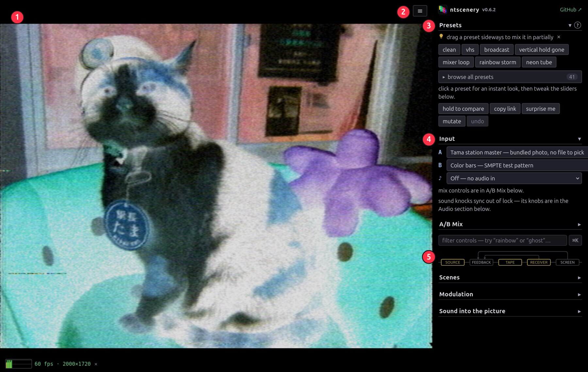

**1** the picture — drag a box on it to magnify, double-click to pull back ·
**2** the ☰ menu — stills, recording, fullscreen, settings · **3** presets ·
**4** input, A and B · **5** the way into all ~234 controls.

What a drag on the picture does is set by the crosshair button at the top right
of the panel: lit, a drag boxes a region to zoom into; dark, it moves the
magnified picture around under your eye. Shift-drag is always the other one, so
both are still there in fullscreen and the popped-out panel, where that button
is off screen.

## Start with a preset

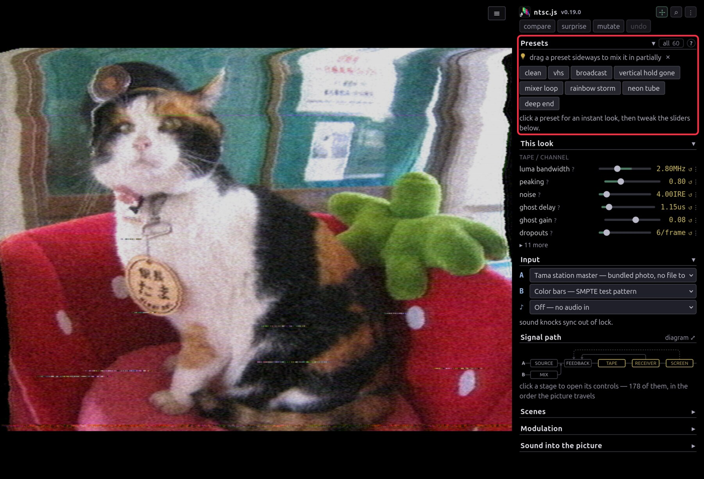

Click one and the board jumps to that look. Every preset is also a fader: drag
it sideways instead and it goes in _partially_, stacking onto what's there.

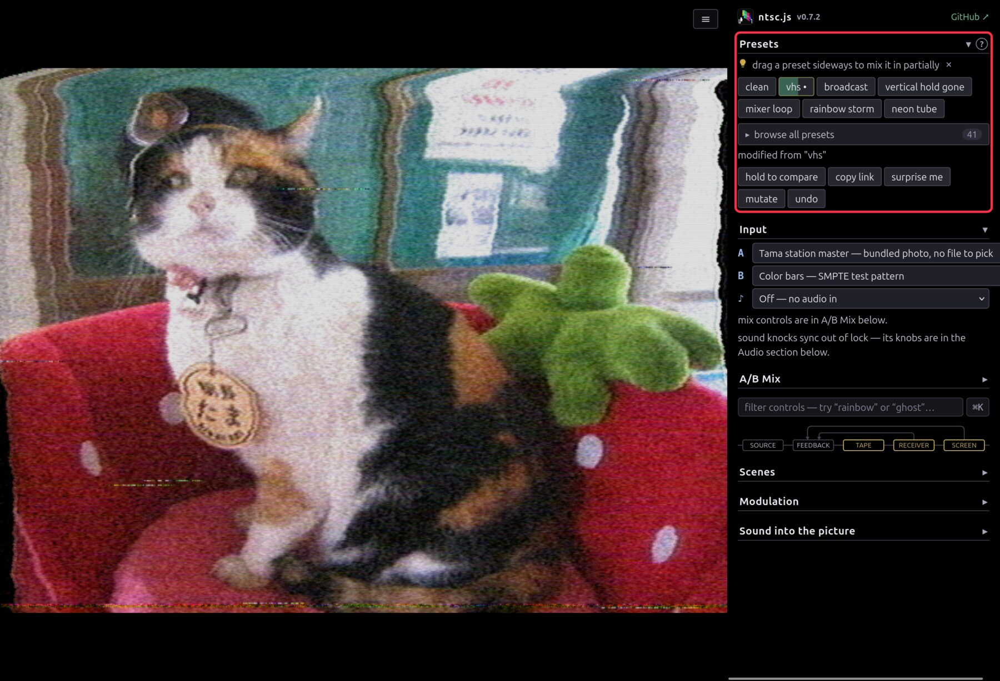

**This look**, right under the chips, is the preset taken apart: every control
the current look moves off stock, as the real sliders, under the module each one
came from. It is the fastest way from "that's a good look" to the knob making it
— drag one and you are editing the preset, press a module name to open it on the
chain map, and press a reading's **↺** to put that one piece back without losing
the rest.

`clean` resets. **hold to compare** (or hold `c`) previews the clean signal.
**random look** and **random nudge** are joined into one control because they
are two ways to do the same job: **random look** stacks a few random presets
into a look you have not seen, and **random nudge** keeps the look you have and
jogs every control a little, which is where the accidents come from — hold
`shift` for a wilder roll, `alt` for a gentler one. The die on any stage heading
is the same nudge aimed at that stage alone.

**morph** says how long a new look takes to arrive. At `cut` a preset, a roll, a
saved look or a step back lands in one frame, the way it always did; at 4s or
30s the whole board _travels_ there instead, every control at once. Two things
fall out of that. The looks between two presets are ones no chip holds, and a
slow morph is the only way to see them — it walks straight through the exact
vertical hold where the picture gives up rolling and the point where the AGC
starts pumping, so it doubles as the way to find where this model's thresholds
are. And rolls chain: a morph started while one is running sets off from
wherever the board has got to, so hitting **random look** every few seconds at
8s wanders continuously through preset space rather than snapping between stops.
While one travels, the morph button becomes a bar filling towards the new look
and reads **stop here**: press it and the morph ends where it stands, because
the half-way look is a look and it is yours to keep from there. Grabbing any
slider does the same thing. Modes (the toggle rows) cut at the half-way point
rather than travelling, because there is no tube half way between two phosphors,
and the magnifier never morphs at all.

Finding a look is a walk, so the walk is retraceable: **undo** (`ctrl+z`) steps
back through everything you have been through, and `ctrl+shift+z` steps forward
again. A wild roll costs one keystroke to take back, which is the point of
rolling wildly. A step takes as long to arrive as **morph** says, so at 8s the
way back is a transition you can watch too — stepping back and forth over one
change is the cheapest way to see exactly where it starts to bite. Every stage
heading also carries a **die** that nudges only that stage — keep the look,
nudge one circuit.

Six mechanisms, each starting from the preset that names it and pushed past
where the preset stops — every one a link you can open and keep pushing:

|                                                                       |                                                                                 |                                                             |
| :-------------------------------------------------------------------: | :-----------------------------------------------------------------------------: | :---------------------------------------------------------: |
|      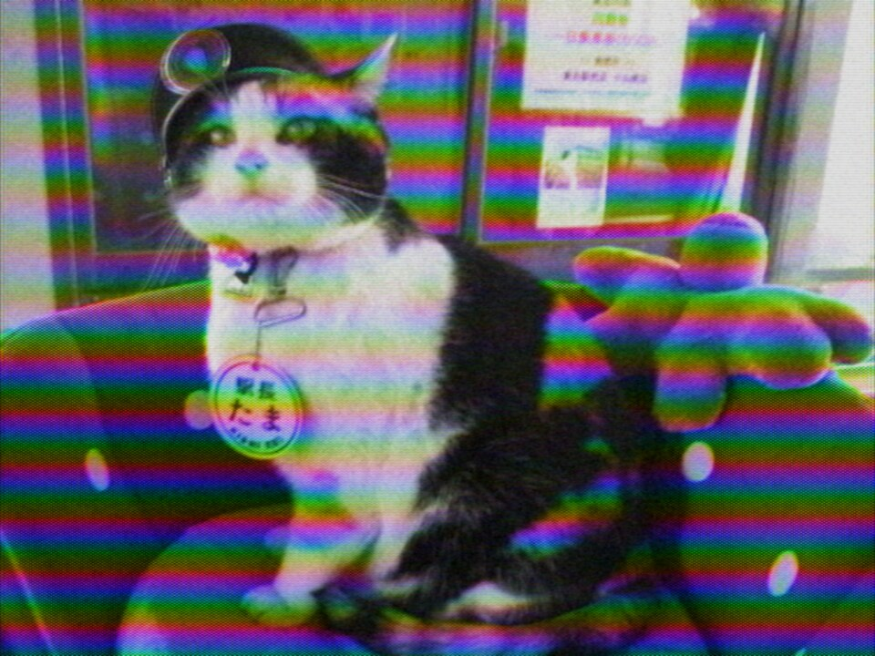      | 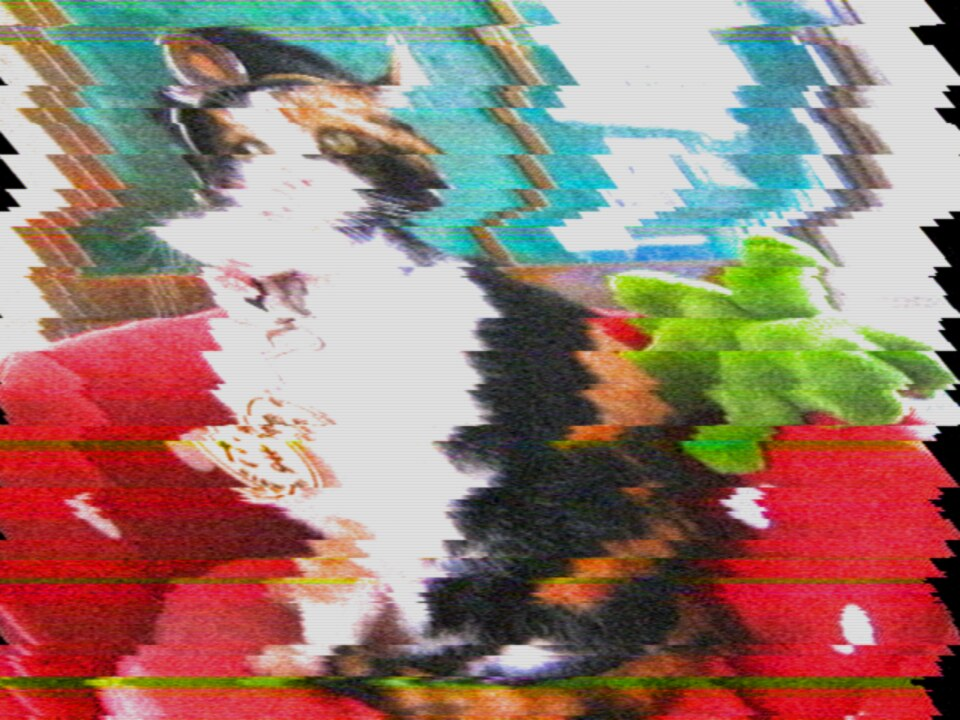 |    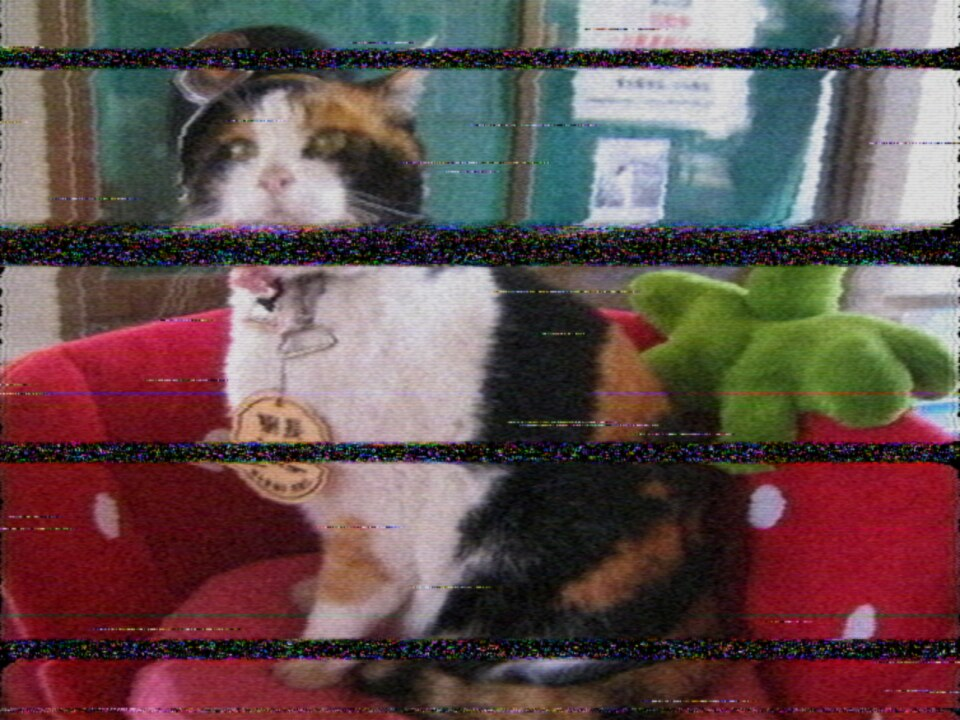    |
| 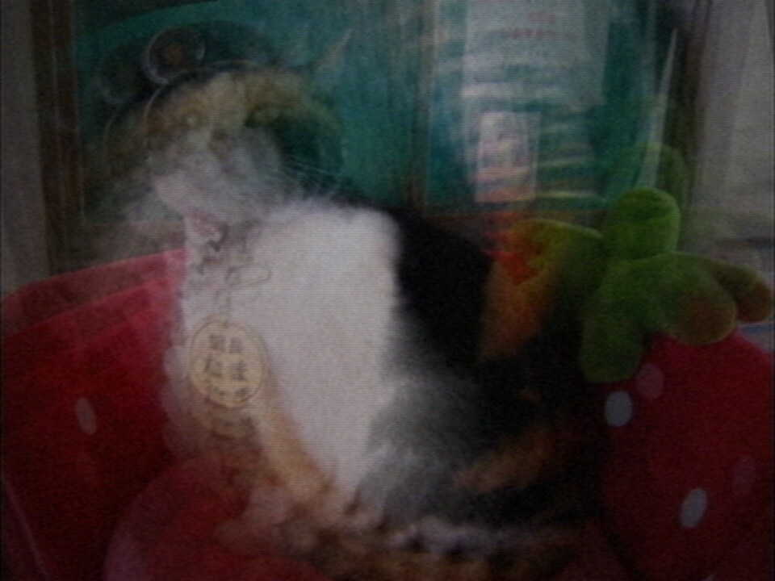 |       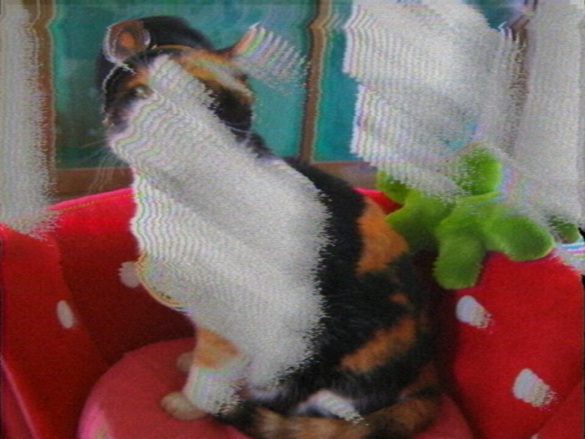        | 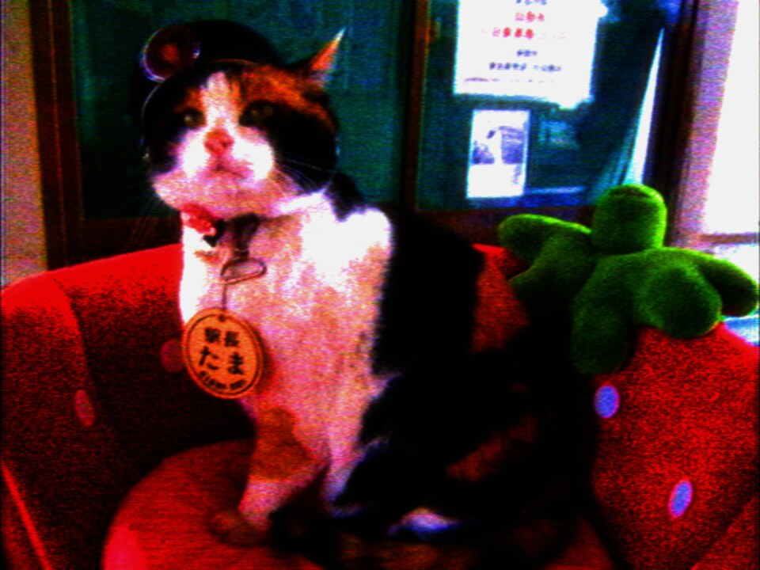 |

**rainbow storm** pulls the colour crystal off frequency · **scrambled channel**
suppresses sync · **picture search** drags the head across four tracks a sweep ·
**fb bloom** points a camera at the monitor · **key loop** patches the composite
back into itself through a luma key · **neon tube** drives the gun past where it
can still hold a colour.

## Give it something to mangle

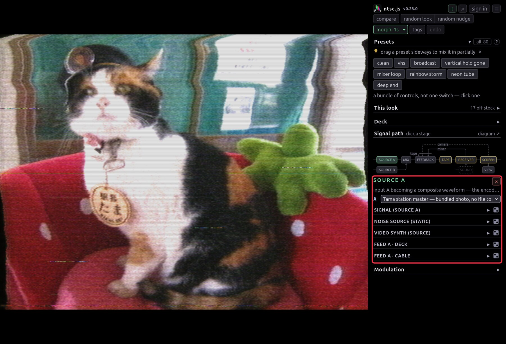

Each source is picked at the head of its own stage on the signal path: **A** on
the SOURCE A box, **B** on SOURCE B, the sound on SOUND. The box names the
thing, and opening it puts the picker first and that source's own controls under
it.

**A** is the main source: bars, sweep, snow, the bundled photo, a file of your
own, or a webcam — which is also how an RCA capture dongle gets real gear in
here. **Clips…** is a shelf of your own footage: files you have opened before,
kept as a list you click through mid-set instead of going back out to the OS
dialog every time. Add a whole folder and everything directly inside it lands on
the shelf at once, and every row plays into either deck, so a two-source set
never has to reopen it. What a reload costs depends on the browser: Chrome and
Edge can hold a folder open, so one permission covers the lot and the whole
shelf comes back after a single prompt; Firefox and Safari cannot hold a file
open past a reload at all, so the list survives and the footage does not —
re-pick the same folder once and every row reconnects by name, nothing added
twice. The **Wikimedia Commons** band is footage nobody has to have: seven
channels — found photos, statuary and dead malls, reefs and birds, portraits,
and three of moving footage (time-lapse, fountains and water, animals and fire)
— and each one is a _search_ rather than a picture, so picking it rolls a file
out of the pool and clicking the caption underneath rolls the next one. That is
the whole of it: the caption is the only thing on screen that says which file
came back, and the roll before it is gone. So keep the ones worth keeping — the
**★** beside the caption pins the picture that is up to your favourites, and
**Favorites…** at the foot of the same band is the shelf of them, playable into
either deck. A star keeps the file's _name_, not a copy, so it costs nothing on
disk and comes back at whatever size the app asks for today; the **↗** next to
it opens the file's own page on Commons, which is where the licence and the
photographer are. Both verbs are in the command palette too (⌘K —
`roll another`, `star this`), which is where you want them mid-set with the
stage folded. **Video synth** is the one generated source that makes a picture
instead of a failure to have one: two oscillators, a combiner and a colorizer,
with no input at all. Its one real knob is frequency, because what a video synth
draws is where it sits against the raster — put an oscillator on an exact
multiple of line rate and you get standing bars, a few hertz off and they lean
and creep, wind it down to field rate and the same ramp is a vertical gradient,
wind it up to 3.58 MHz and it lands on the colour subcarrier and the whole
screen comes back as flat colour that turns as you detune. **Screen / window…**
shares a window, a tab or a whole display straight into the chain, so anything
on your desktop can be the signal: a video player, a game, a patch in
TouchDesigner. Point it at _this_ window and the loop closes — the set is
re-shooting its own face through the compositor, which is camera feedback
without the camera. Stop the share from the browser's own bar and the input
drops to snow, the same as a set losing its feed. **Teletype…** is the odd one
out: type your own words and they are printed onto a text card a character at a
time, in a dot-matrix font coarse enough that the chain has something to chew
on. The box under the picker edits the card as you type. Since the card is dots
rather than glyphs you can draw on it too — the **draw** tab in that dialog is a
paint surface on the 40×24 page the character set was designed around, with a
pen that works a block at a time, a solid brush and the three dither shades.
Right-drag erases, ⌘/ctrl+Z takes back a stroke, and every stroke lands back in
the card's text as the mosaic character that carries it, so a drawing shares
through a link like the words do. The shades are worth a try on their own: a
dither is a half-rate checker by the time it reaches the decoder, which is
exactly what dot crawl and chroma bleed feed on. Tick **crawl** and it rolls up
the frame instead of holding still, and **boil** hands it to an unsteady hand:
the card is redrawn eight times a second with every cell's dots landing up to a
dot off, so the strokes crawl and the letters shiver. It is worth ticking for a
reason beyond the wobble — a still card gives still artifacts, the ringing
parked on the same stems, and a boiling one makes the chain decide all of it
again every frame, so the dot crawl actually crawls. The words never change, and
a link carries the same card either way. **B** is a second source, deliberately
not genlocked, so mixing it in beats and tears against A; its controls are the
**Mix** box on the map below — which is also where the **chroma key** lives, for
cutting B's backing colour away so A shows through it. Because the keyer sits on
the bus rather than on the picture, it slices the chroma the encoder made, so
the matte comes out soft across and sharp down the way a composite key always
did — and left un-genlocked, B's colour drifts under the key and it breathes.
Its best trick is with the **video synth** in B: the colorizer turns level into
hue, so B is a ramp _through_ the colour wheel and the key cuts a band out of it
— the acceptance angle becomes the width of the hole and the backing hue becomes
where it sits, with nothing anywhere drawing a stripe. The `key sweep` preset
walks that hue with an LFO, so the hole travels and the picture dissolves into A
one colour at a time. **♪** is audio in — a mic, a track, or the clip already on
screen playing its own sound — which does nothing until you turn up a knob in
the **Sound** box on the map below.

Anything with a timeline — a file, a clip off the shelf, a Commons roll — gets a
seek bar under its picker and a **cue** button under that. The cue is one button
doing three things in a cycle: press it and it marks the playhead, press it
again and the stretch between the two marks becomes a loop that starts repeating
at once, press it a third time and the loop drops and a new cue lands where you
are. The span shows up drawn on the seek bar, so a loop is something you can see
the length and the position of rather than two numbers to read. **⇤** beside it
jumps back to the cue without waiting for the loop to come round — on its own,
with no loop marked at all, that is a stutter you play by hand, and hammering it
in time is the point of it. `i` and `o` are the same two gestures on the
keyboard, and `shift` puts them on source B, which is where they are worth
having: both decks loop independently, so one can hold a half-second stutter
while the other runs. A loop is two positions in one particular clip, so it goes
away when the source does — it is not part of a look, and no preset will bring
it back — but it does ride along in a shared link, so "this two seconds of this
file" is a thing you can send someone. Dragging the seek bar out of a running
loop lets the loop go and keeps the cue.

Whether a loop wraps cleanly is a property of **how the file was encoded**, not
of the loop, and it is worth knowing about because it is not rare. Jumping back
costs whatever the decoder has to walk through to get there: from the nearest
keyframe at or before your in-point, forward, a frame at a time. A file with
keyframes every half second loops freely anywhere in it. One with four keyframes
in twenty seconds can stall a fifth of a second on every lap wherever you mark
it — and how bad it gets depends on the footage as much as on the spacing, since
a busy frame costs more to decode than a simple one.

The clips on the shelf here differ by more than ten to one, measured
(`scripts/loopseek.mjs` takes `--file=` and will say the same about your own
footage):

| Clip               | Jump back costs | Why                          |
| ------------------ | --------------- | ---------------------------- |
| Minnie the Moocher | ~15ms           | a keyframe every 0.4s        |
| Popeye             | 15–60ms         | every ~3s, and small frames  |
| Test pattern       | 120–165ms       | one keyframe in six seconds  |
| The Haunted House  | 130–230ms       | four keyframes in twenty-one |

You do not have to take that on trust or go measuring: with a loop running, the
cue row shows what its own jump back is costing — `wrap 0.15s`. Under about a
tenth of a second nothing is visible. Above it the picture catches on every lap,
and the number is the thing to work against: mark the loop somewhere else and
watch it change, since some in-points land near a keyframe and are cheap and
there is no way to see from here which. Failing that, re-export the file with
denser keyframes, which is one flag to ffmpeg (`-x264-params keyint=30`).
Nothing about the loop is wrong when this happens and the picture keeps playing
— it is the jump back that stalls.

Running locally adds a **YouTube…** source (`yt-dlp` on the dev server); the
hosted build has no server to do that with.

## Working down the chain

Controls live where they sit in the signal path, not in one long list. The map
at the head of the sidebar is the whole path, and every box on it is a button.
**Source A** and **Source B** are your two inputs — the same rig twice, each
with its own signal, deck and cable — and they meet at **Mix**, after which one
chain runs to the glass while the loops feed the picture back into it. Amber is
a stage you've moved something in, and a dashed **Source B** and **Mix** mean
nothing is patched into B yet. Click one to open its controls below:

The three wires arcing over the trunk are the feedback loops, each named on its
own run and each a button: **camera** is optical and drawn dashed, **mixer** is
the composite bus patched back into itself, and **tape** is the short one
straddling **Feedback** — a loop bin across the bus rather than a run around the
chain. A run lights up while its loop is actually running, and clicking one
opens that loop's controls rather than the whole **Feedback** stage.

**diagram ⤢**, beside the map's heading, draws the same path with room for the
parts the miniature has to leave out — each source's own feed, and a sentence on
what each stage and each loop actually does. Every box and every loop there
opens its controls too.

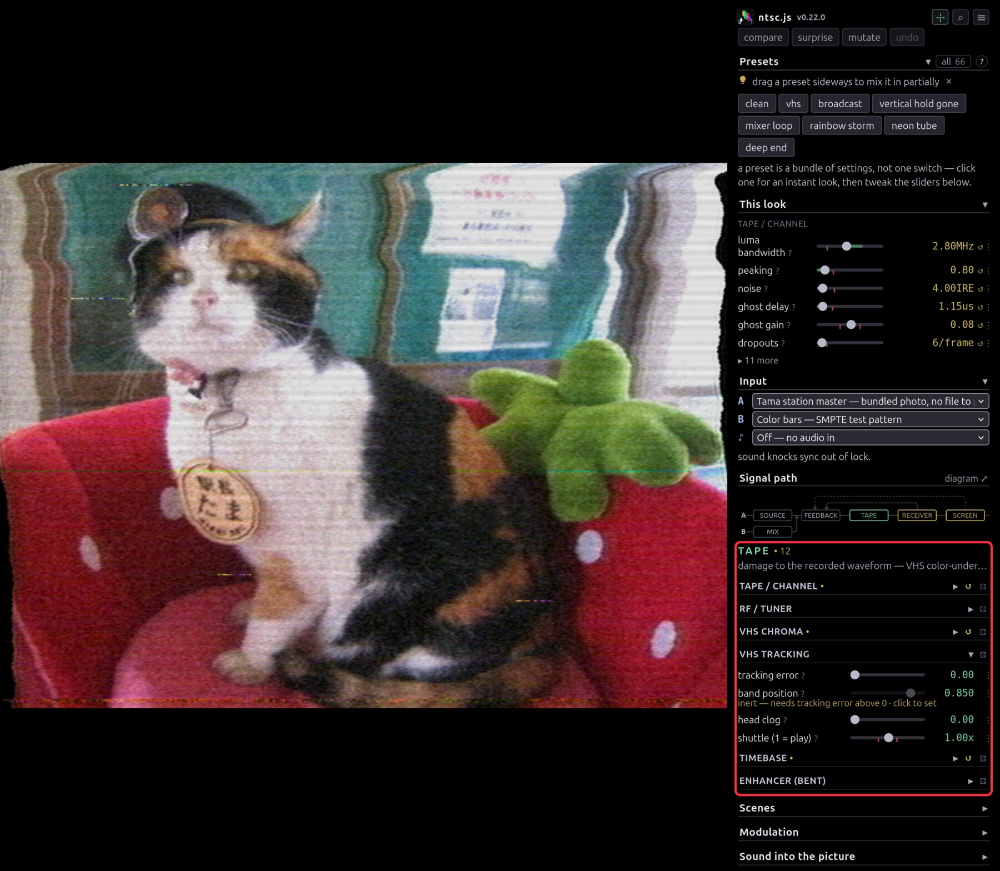

- **• 10** counts what you've moved in that stage; click it to jump there.
- **?** on any slider explains the fault it models — hover for a line, click for
  the card.
- A reading in **amber** is a control off stock, and the **↺** beside it puts it
  back — as does a double-click on its track. A group heading carrying a **↺**
  puts that whole module back, and `ctrl+z` takes that back in turn.
- **⋮** on a row is the wiring: pin it to Favorites, start an LFO on it, or —
  once a controller is connected — learn a MIDI knob or lock it to the clock.
- **"inert — needs …"** means another control gates this one. Click the note to
  set it.

The help says what breaks in the hardware, not what you'll see — the look is
emergent, and the cause is what tells you how two controls will combine.
[EFFECTS.md](EFFECTS.md) gathers all of them onto one page, if you'd rather read
than hover.

The two **loops** on the map are the exception to working left to right: they
take the picture off the end of the chain and put it back at the front, so they
compound the damage every other stage is doing. A camera aimed a hair off-axis
from the monitor it's watching, over a tape that's dropping out under it:

<video
  controls muted loop playsinline
  poster="img/clip-feedback-poster.jpg"
  src="https://cmdcolinphotos.s3.amazonaws.com/phosphene/clip-feedback.mp4"></video>

## Finding a control

Both searches cover the help text, so you can hunt an artifact without knowing
the knob. The filter box narrows the panel:

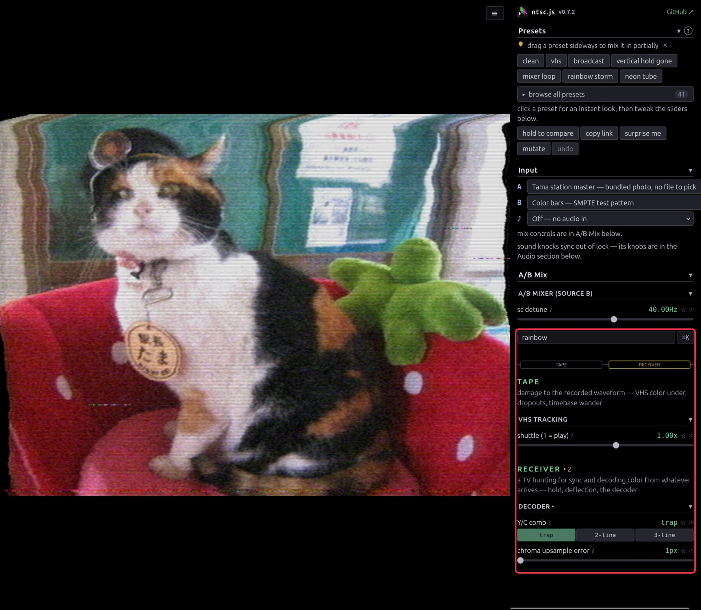

`ctrl+k` opens the palette over presets, controls and actions at once; `←→`
nudges the highlighted control live.

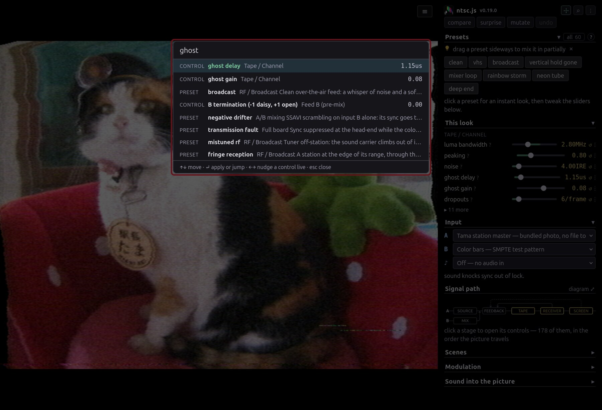

## Making it move

**∿ on any control row** — press it and that control starts wobbling
immediately: an LFO, a random walk, a sample-and-hold, a Lorenz attractor or the
audio envelope. Depth is a fraction of that control's own range, and the slider
itself stays put — it is the centre the motion happens around, which is why a
preset or a link still holds the look.

Once anything is moving, a **motion** strip appears above the filter box: one
amount over every routing, and a freeze that holds the waves where they are so
letting go picks the drift back up mid-stride. Some presets arrive already
moving — `rainbow storm` wanders off frequency, `vertical hold gone` hunts,
`fb bloom` sways on its mount — and **copy link** carries whatever you patch.

The **3∿** at the end of the strip counts what is being driven, and clicking it
filters the panel down to exactly those rows — wherever in the chain they sit. A
routing never moves the slider itself, so this is the only thing that marks a
moving control from outside its own row; the chain map narrows with everything
else, which makes it a map of where the motion is. Typing `moving` in the filter
box asks the same question, and so does **show what is moving** in the palette.

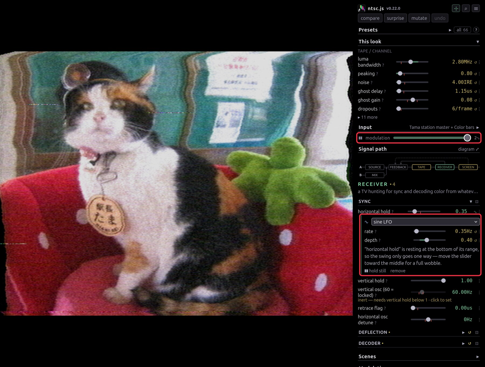

The **Modulation** section shows all eight slots at once if you would rather
patch them there — and it is the one place to see the bay as a bay, which is
what tells you why the ninth ∿ has nowhere to go.

At the top of it is the **tempo**: type a BPM in, or hit **tap** four times on
the beat. Any wobble's rate can then be locked to it — **♩** in the rate
slider's **⋮** cycles 1/1, 1/2, 1/4, 1/8, 1/16 and back to free-running, and the
row shows a **♩1/4** badge while it is locked. The Hz you had dialed in waits
underneath and comes back when you cycle the lock off. MIDI clock takes the
tempo over whenever something is sending it — see [MIDI.md](MIDI.md).

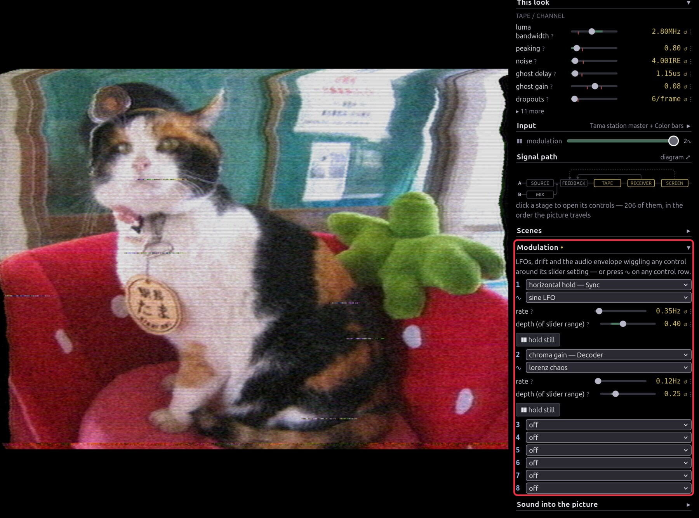

**Sound** — the branch under **Receiver** on the map, because that is where the
sound is patched in: bass lurches the frame, level tears line hold, the waveform
draws itself on the screen. Pick something under **♪** on the map's Sound box
first — a mic, a track, or the clip on screen playing its own sound — or the box
stays dark and opens onto nothing, the same answer **Source B** gives with
nothing patched in.

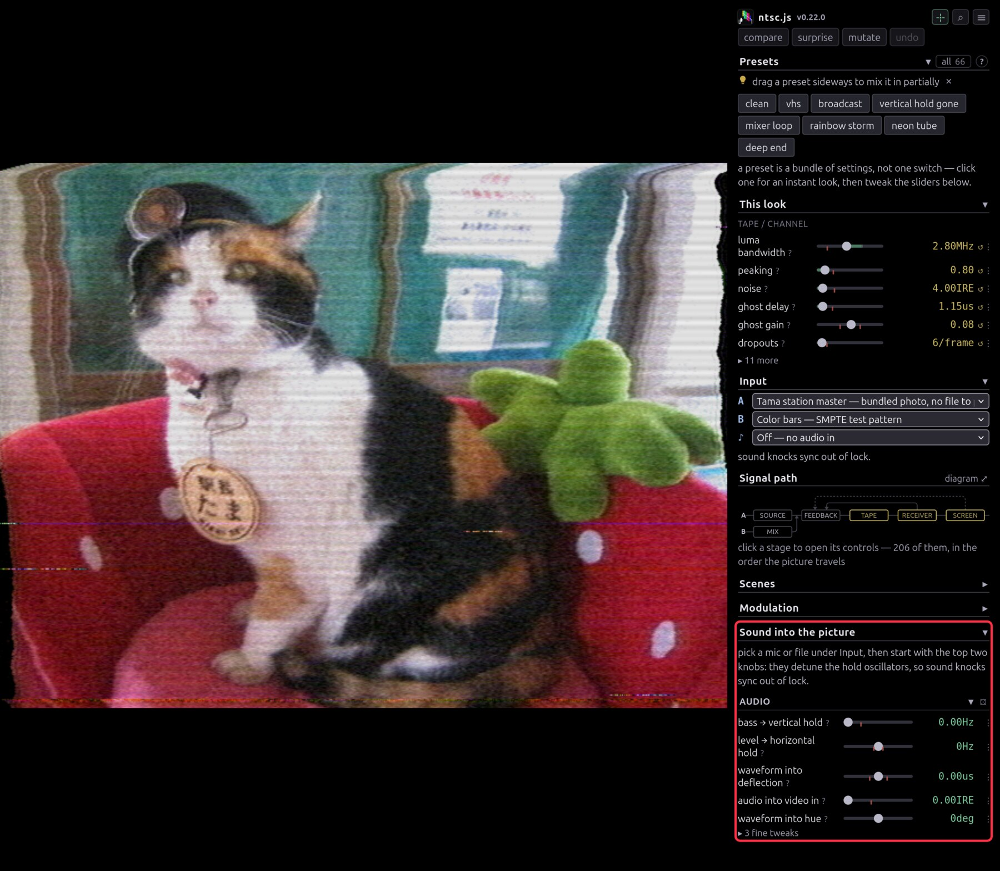

**MIDI** — the real answer if you want to play this. Automap or learn one knob
at a time, no jumps when a knob is out of position, rates locked to clock. See
[MIDI.md](MIDI.md).

## Keeping what you find

**saved** in the look bar is the library: name the board and get it back later,
on this machine or the next one. It is kept on your account, so it needs a
sign-in. `ctrl/⌘+S` saves under the offered name without opening the menu.

The first nine are on the number keys — `1–9` recalls one, `shift+1–9` keeps the
board over it. That is the whole live-set gesture: no naming, no menu. Position
in the list is the binding, so deleting the third saved look shifts the ones
below it up a key.

A recall brings back the controls and the motion and leaves your input alone —
it will not pull the webcam out mid-set to put a still back. **⧉** copies a link
that carries both, source clip included: a link is a patch. `s` saves a still,
`r` records a clip.

## Looking closer

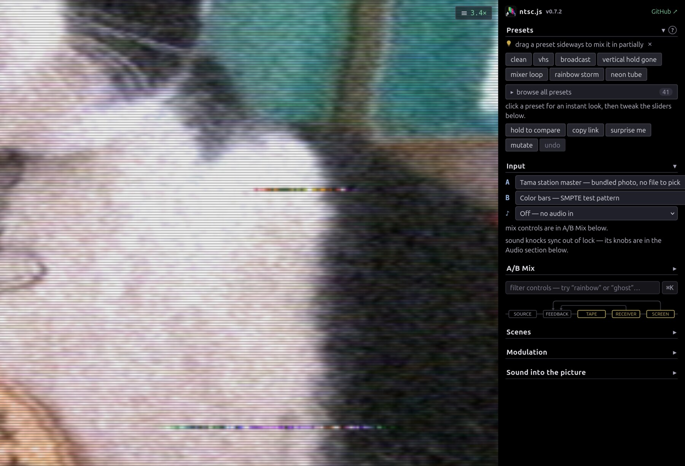

Drag a box to zoom, drag to pan once you're in, double-click to reset. The
magnifier is part of the display, so it magnifies the lit tube face — scan
lines, mask and all.

As sliders it is the **View** box on the map, hanging off **Screen** with its
arrow pointing the other way from the two under the trunk: everything else down
there is patched into the chain, and this is the one thing the chain is
delivered to. It holds the slow-motion and frame-rate controls for the same
reason — how fast the rig is stepped is a viewing condition, not a fault — and
nothing in it changes the signal, so a nudge is forbidden to touch any of it.

The **Display** miniature in the panel takes the same box: drag a rectangle on
it and the lens goes there at whatever magnification the box asks for, so you
never have to set the number before you can aim. Once you're in, the lens
rectangle is a handle — drag it to push the view around, or drag outside it to
box a new one. A click still aims at the current magnification, shift-drag walks
the aim around, and alt drags off the snap guides.

To watch the signal instead of the picture, use **signal tap** — a row in the
panel's **View** group, which steps through the taps so the picture changes
under your hand: the composite waveform, luma, chroma energy, the decoder's
burst state, the scope, then back to the picture. The same taps are in
**advanced settings**, named at length, which is where fullscreen and the
popped-out panel reach them. Whichever tap is live is named on the ☰ button, so
a screen full of waveform never looks like a fault.

**scope** is the one to reach for first. It draws a single line the way the
app's own icon does and the way a waveform monitor does: the whole line laid out
left to right, sync tip and colour burst included, against an IRE graticule,
with the picture still running dimmed above it and a dashed cursor marking the
line being traced. Each column is filled between the lowest and highest sample
it covers, so flat luma draws as a thin line and anything carrying subcarrier
draws as a block as tall as its swing, tinted the colour it is carrying, with
the luma it rides on as a bright line through the middle. Sync depth, setup, the
AGC pumping and a burst that has stopped being 40 IRE are all readable there
rather than inferred.

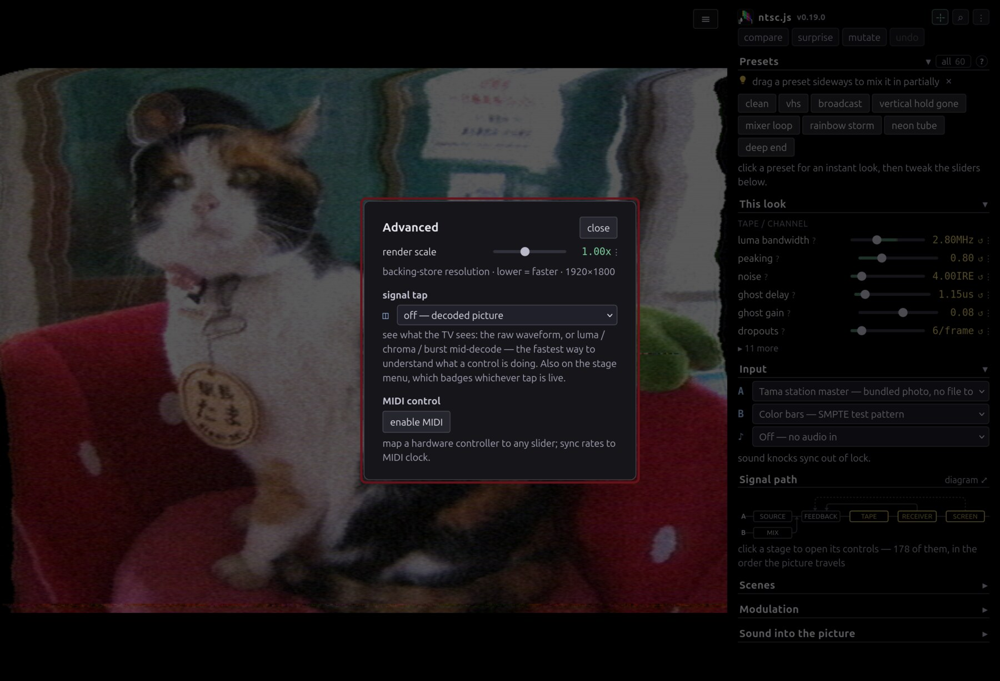

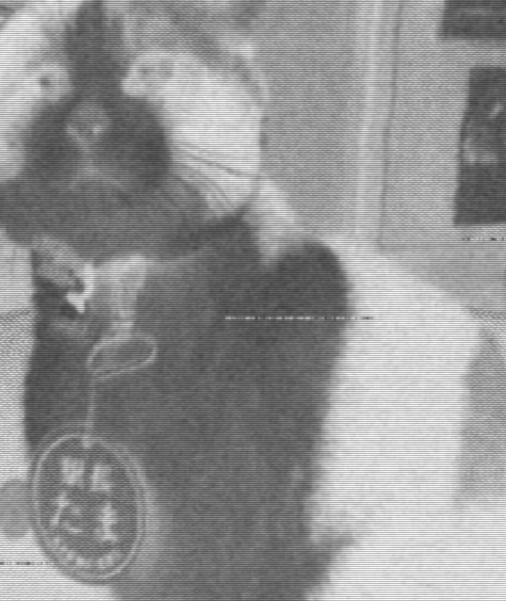

Turning a knob and watching the waveform change shape is the fastest way to
understand it. **render scale** in the advanced dialog trades resolution for
frame rate.

## Getting it out

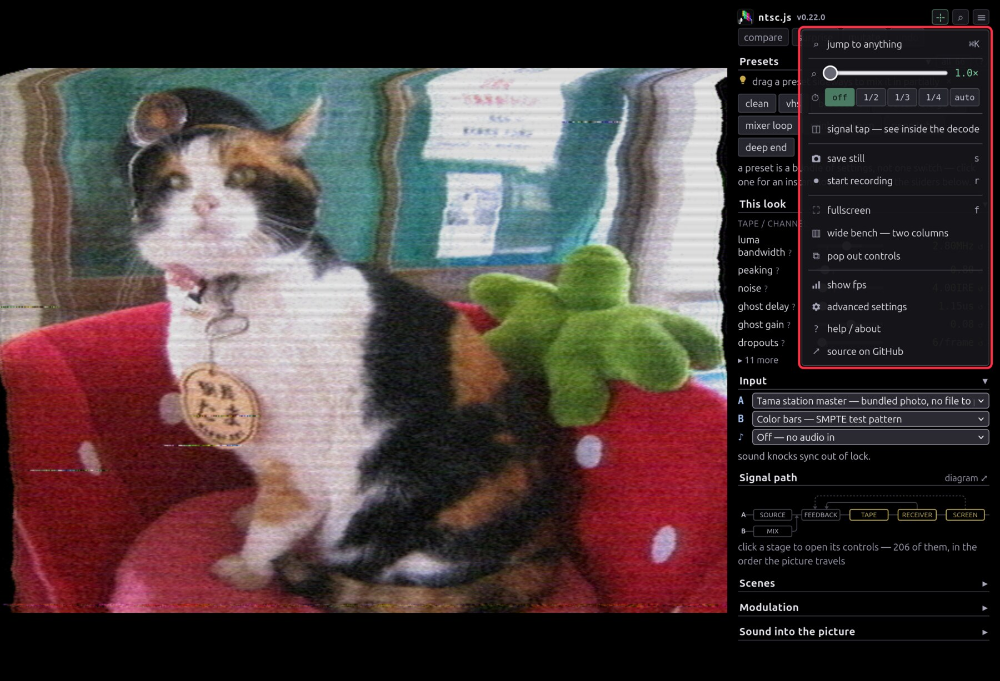

Everything that isn't a signal control lives here: stills, recording,
fullscreen, and **pop out controls**, which moves the panel to a second window
and gives the picture the screen. For anything you care about, point OBS at the
window — it beats the in-browser recorder and follows the magnifier at full
resolution.

## Keyboard

| Key                     | Does                                                |
| ----------------------- | --------------------------------------------------- |
| `ctrl/⌘+k`              | command palette                                     |
| `c` (hold)              | preview the clean signal                            |
| `r` / `s`               | record a clip / save a still                        |
| `f`                     | fullscreen                                          |
| `i`                     | cue a clip · press again to loop from there         |
| `o`                     | stab back to the cue · `+shift` for source B        |
| `1`–`9` / `shift+1`–`9` | recall / overwrite one of your first nine saves     |
| `ctrl/⌘+z`              | step back a look · `+shift` steps forward again     |
| `esc`                   | close a dialog, cancel a MIDI arm, clear the filter |

## Where next

- [EFFECTS.md](EFFECTS.md) — every control and the fault it models
- [HOW-IT-WORKS.md](HOW-IT-WORKS.md) — the signal path, pass by pass
- [MIDI.md](MIDI.md) — setting up a controller
- [DEVELOPMENT.md](DEVELOPMENT.md) — running it locally, URL params, this page's
  screenshot harness
