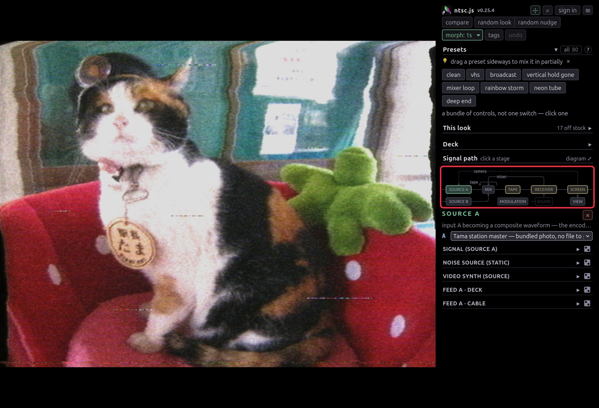
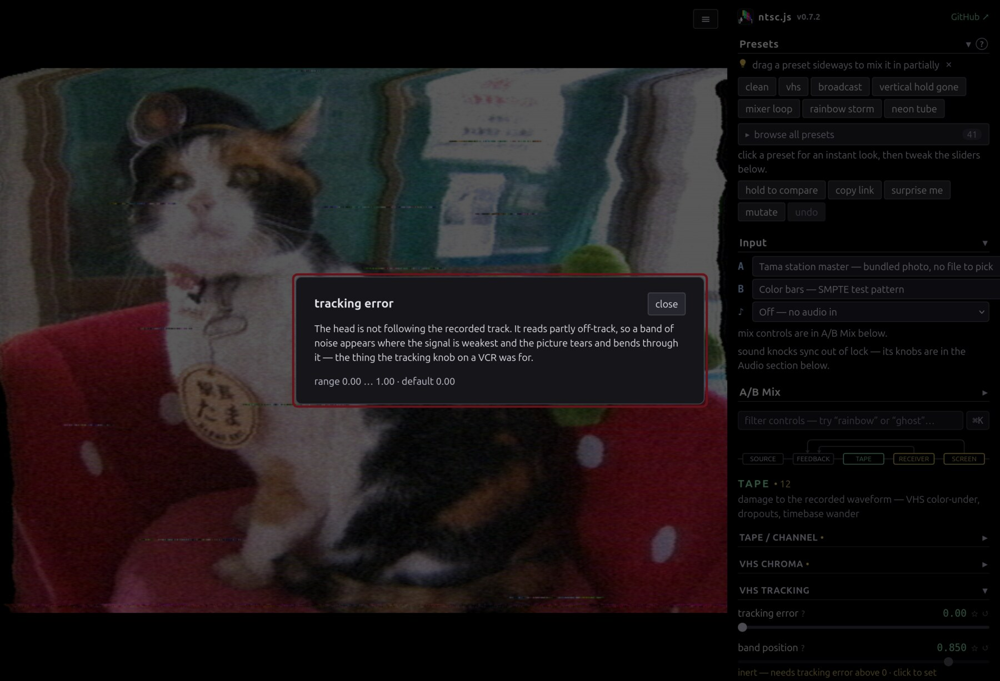

# User guide

The rest of the app, once [Getting started](GETTING-STARTED.md) has you rolling
presets.

## Presets and looks

Click a preset and the board jumps to it. Drag it sideways instead and it goes
in part of the way, stacking onto whatever is already there.

- **This look** lists every control you're off stock on, as real sliders, filed
  under the module each came from. Drag one and you're editing the preset; **↺**
  puts one piece back.
- **clean** resets. Holding **compare** (or `c`) previews the clean signal.
- **random look** stacks a few presets into something you haven't seen. **random
  nudge** keeps your look and jogs everything a little — `shift` for a wilder
  roll, `alt` for a gentler one. This is where most of the good accidents come
  from.
- **morph** sets how long a new look takes to arrive: a frame at `cut`, or up to
  8s travelling through states no preset holds. Rolls chain, so hitting random
  look every few seconds wanders continuously.
- **undo** (`ctrl+z`) steps back through all of it.

## Sources

Each source is picked at the head of its own stage: **A** on the SOURCE A box,
**B** on SOURCE B, sound on SOUND.

- **A** takes bars, sweep, snow, the bundled photo, a file, or a webcam — which
  is also how an RCA capture dongle gets real gear in here.
- **Clips…** is a shelf of files you've opened before, replayable without the
  file dialog. You can add a whole folder. Chrome and Edge hold a folder across
  a reload; Firefox and Safari can't, so re-pick it once and every row
  reconnects by name.
- **Public archives** rolls a file out of Wikimedia Commons or archive.org, or
  **Browse…** searches both with a thumbnail grid. **★** keeps a clip on your
  shelf and caches it, so the second view is instant.
- **Video synth** is two oscillators and a colorizer with no input. Frequency is
  the whole knob: on a multiple of line rate you get standing bars, a few hertz
  off they lean and creep, at 3.58 MHz it lands on the subcarrier and comes back
  as flat colour.
- **Teletype…** prints what you type onto a 40×24 dot-matrix card, and **draw**
  paints on the same page. The dither shades are worth a try — a dither is
  exactly what dot crawl and chroma bleed feed on.
- **B** is a second source, deliberately not genlocked, so it beats and tears
  against A. Its controls are in the **Mix** box.
- **♪** is audio in, and does nothing until you turn up a knob in **Sound**.

**Cue and loop.** Anything with a timeline gets a seek bar and a **cue** button:
press to mark, press again to loop, a third time to drop it. **⇤** stabs back to
the cue without waiting for the lap, which is a stutter you play by hand. `i`
and `o` do the same from the keyboard and `shift` puts them on B. The cue row
shows what your loop's jump back costs as `wrap 0.15s` — under a tenth of a
second you won't see it, above that the picture catches every lap, so mark it
elsewhere or re-export with denser keyframes.

## Working down the chain

The map at the top of the sidebar is the whole signal path, and every box on it
is a button. Amber marks a stage you've moved something in.

The three wires arcing over the trunk are the feedback loops, each its own
button: **camera** is optical and drawn dashed, **mixer** is the composite bus
patched into itself, **tape** is a loop bin straddling the mix.

**DECK** and **MODULATION** sit apart, on a row below the chain, because they
are patched into the controls rather than into the signal. MODULATION is the
hand you set running and leave. DECK is the hand that's on it now — the
transition lever, the inset, both tape transports, the tracking knob, the hold
that stops the frame dead — gathered by the gesture that moves it rather than by
where the fault happens, so a take is one surface instead of four stages.

Inside a stage: **• 10** counts what you've moved, a reading in amber is off
stock, **↺** reverts, **⋮** is the wiring (pin to favorites, start an LFO, learn
a MIDI knob), and **"inert — needs …"** means another control gates this one.

**?** on any slider explains the fault it models rather than what you'll see.
The look is emergent, so knowing the cause is what tells you how two controls
will combine. [EFFECTS.md](EFFECTS.md) collects them on one page.

The loops are the exception to working left to right: they take the picture off
the end and put it back at the front, so they compound whatever else is going
on. Here's a camera aimed a hair off-axis from its monitor, over a tape that's
dropping out underneath:

<video
  controls muted loop playsinline
  poster="img/clip-feedback-poster.jpg"
  src="https://cmdcolinphotos.s3.amazonaws.com/phosphene/clip-feedback.mp4"></video>

## Finding a control

The filter box narrows the panel and `ctrl+k` opens a palette over presets,
controls and actions at once, with `←→` nudging the highlighted control live.
Both search the help text, so you can hunt down an artifact without knowing
which knob makes it.

## Making it move

**∿ on any control row** sets that control wobbling — sine or triangle LFO,
random walk, smoothed noise, sample-and-hold, a Lorenz attractor, the audio
level or its hits, or a one-shot envelope you strike by hand or from a MIDI
note. Depth is a fraction of that control's own range and the slider stays put,
since it's the centre the motion happens around. That's why a preset or a link
still holds the look.

Once anything is moving, a **motion** strip appears above the filter box with
one amount over every routing and a freeze. The **3∿** at the end counts what's
being driven and filters the panel down to those rows.

At the top of the **MODULATION** box is the tempo: type a BPM or tap it in four
beats, then lock any rate to it with the **♩** in that row's **⋮**. MIDI clock
takes over whenever something is sending it — see [MIDI.md](MIDI.md).

**stabs** flip the whole board back to clean for a few tens of milliseconds at a
time, so the look gets poked into a clean picture rather than running flat out.
Phosphor, the feedback loops and the tape bin keep running through the flip, so
a stab leaves a trail behind it.

**Sound** hangs off Receiver, because that's where audio is patched in. Bass
lurches the frame, level tears line hold, and the waveform draws itself on the
screen. Pick something under **♪** first or the box opens onto nothing.

## Keeping what you find

**saved** in the look bar is your library, kept on your account, so it needs a
sign-in. `ctrl/⌘+S` saves under the offered name, and the first nine sit on the
number keys — `1–9` recalls, `shift+1–9` overwrites. Position in the list is the
binding, so deleting the third save shifts everything below it up a key.

A recall brings back the controls and the motion and leaves your input alone.
**⧉** copies a link carrying both, source clip included. `s` saves a still, `r`
records a clip.

## Looking closer

Drag a box on the picture to zoom, drag to pan, double-click to reset. The
magnifier is part of the display, so it magnifies the lit tube face along with
the picture: scan lines, mask and all.

To watch the signal instead of the picture, **signal tap** in the View group
steps through the composite waveform, luma, chroma energy, the decoder's burst
state, the scope, and back. Whichever tap is live is named on the ☰ button, so a
screen full of waveform never looks like a fault.

**scope** is the one to reach for first. It lays a single line out left to
right, sync tip and burst included, against an IRE graticule. Sync depth, setup,
the AGC pumping and a burst that has stopped being 40 IRE are all readable there
rather than inferred. Turning a knob and watching the waveform change shape is
the fastest way to understand it.

## Getting it out

The ☰ menu has stills, recording, fullscreen, and **pop out controls**, which
moves the panel to a second window and gives the picture the whole screen. For
anything you care about, point OBS at the picture window — it beats the
in-browser recorder and follows the magnifier at full resolution.

## Keyboard

| Key                     | Does                                                |
| ----------------------- | --------------------------------------------------- |
| `ctrl/⌘+k`              | command palette                                     |
| `c` (hold)              | preview the clean signal                            |
| `r` / `s`               | record a clip / save a still                        |
| `f`                     | fullscreen                                          |
| `i`                     | cue a clip · press again to loop from there         |
| `o`                     | stab back to the cue · `+shift` for source B        |
| `1`–`9` / `shift+1`–`9` | recall / overwrite one of your first nine saves     |
| `ctrl/⌘+z`              | step back a look · `+shift` steps forward again     |
| `esc`                   | close a dialog, cancel a MIDI arm, clear the filter |

## Where next

- [Effects & features](EFFECTS.md) — everything it can break
- [How it works](HOW-IT-WORKS.md) — the code: one array and a chain of GPU
  shaders
- [MIDI](MIDI.md) — setting up a controller
- [DEVELOPMENT.md](DEVELOPMENT.md) — running it locally, URL params, the
  screenshot harness
